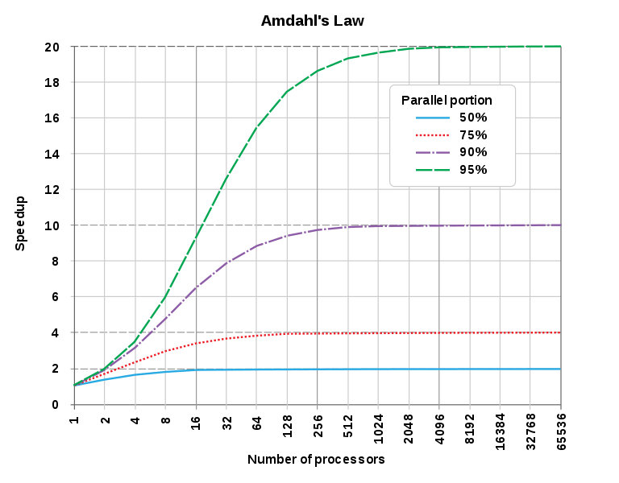

<!--
# MUST-HAVE:

[X] Course Outline
[X] Physical exemple with a book
[X] Parallelisation theory
  [ ] Embarassingly parallel problems (
https://stackoverflow.com/questions/806569/whats-the-opposite-of-embarrassingly-parallel)

Trade-off of the task size (small => locally short but a lot of communication / orchestration, and vice-versa).

[X] CPUs, GPUs, TPUs
[X] MapReduce principles
  [ ] MapReduce trade-off
[ ] How to parallise in practice

## How to parallelize in practice? (cours de Matthieu)

https://github.com/DavisVaughan/furrr

  
Recall: embarrassingly parallel problems.


[ ] Exemple MapReduce: Moyenne
[ ] Exemple MapReduce: Median
[ ] Exemple MapReduce: Linear Regression

## Is it always possible to parallelize?


# NICE TO HAVE:

[ ] Colors
[ ] Add distinction between core (physical) and thread (logical)
[ ] Jokes
[ ] Parallel vs. concurrent vs. distributed (opp. sequential)
[ ] Wikipidia's parallel computing portal
[X] https://en.wikipedia.org/wiki/Amdahl%27s_law
[ ] https://cran.r-project.org/web/views/HighPerformanceComputing.html
[ ] http://www.r-tutor.com/gpu-computing
[ ] 2 cours de Matthieu à lire plus prendre des notes
[ ] CPUs, GPUs, TPUs
  [ ] Differences between packages?
  [ ] Add graphs of performence comparison
  [ ] Add exemples demonstration of problems that suit on GPU
    [ ] Embarassingly parallel problems: compute distances (http://www.r-tutor.com/gpu-computing/clustering/distance-matrix)
[ ] Do everything in both R and Python

# READ:

[X] https://en.wikipedia.org/wiki/Parallel_algorithm
-->

# 0. Outline

(0. Outline, quizz)
(1. Introduction)
2. Parallelisation theory
3. CPUs, GPUs, TPUs
4. Map Reduce principle
5. How to parallelise in practice?

---

# 2. Parallelisation theory

---


## Parallelization

Set of **hardware** and **software** technics enabling the similtaneous execution of sequences of independent instructions on multiple computation units

---

## Why parallelize ?
--

- Sequential execution too long
--

- Optimize ressources
--

- Data too big
--

- Data arrives continuously


--
-> Parallelization **can** solve a lot a the big data chanllenges. But it's not magic !

---

## Parallelizable problems

**Not all problems are parallelizable.**

--
There is basically a spectrum from:

--
- **embarassingly parallel problems** (ex: any for loop with no dependency between the steps of the loop)

--
to:

- **inherently sequential problems** (ex: evaluating recursive function, for instance computing Fibonacci numbers, factorials or binomial coefficients)

---

## Amdahl's Law

Depending on the share of the problem that you can parallelize, even in perfect conditions (no information passing cost), you may only expect so much gain from parallisation.

This is known as Amdahl's Law.

If the problem has a share `p` that can be parallelised, you won't be able to speed anything on the `1-p` remaining part.

---

## Amdahl's Law

.height500[]

---

## Parallization architecture

- Shared memory
- Distributed memory
- Hybrid architecture

.footnote[These architecture schemes can be used at any scale! At the core scale, at the (compound) processor scale... or at the cluster scale.]

---

## Shared memory

**Principle:** Multiple computation units share the same memory unit

It is the most common architecture. You can find it in your computer, smartphone, gaming console, etc.

Pros :

- The easiest architecture
- Low transfer time between computation unit and memory
- No memory transfer between memory unit
- It's your OS scheduler which organizes the threads

Cons :

- Synchronization issues
- Data too big to fit in memory ?
- Processors must be close to each other (possible only up to number)

---

## Distributed memory

**Principle:** Multiple computation units which have their own memory.

Mostly use in distributed computing. Each task is executed on a machine with its own CPU and memory.

Pros :

- Multiple average computers with an appropriate architecture are usually more cost-effective than a super computer
- Fault tolerance : each computation unit are independent from each other. If one fail, the **scheduler** just runs the task on a other one.

Cons :

- Can be hard to implement (there are however turnkey solutions at this date)
- Lot of data transfer between computation units
- The scheduler has a lot work

---
## Hybrid architecture

Most of distributed arhictures are actually compound, with memory being shared between **pods** of processing unit, but distributed among **pods**. Algorithms running on such architecture use both types of parallelisation.

---
## Parallelization : the magic solution ?

--
**SPOILER ALERT!** There is no such thing as magic.

--

Exemples of parallelization limitation:

- Communication time between computation units can be important, especially if working on big data sets
- Scheduling can be hard
- Energy consumption
- Non determinist process
  - Race condition
  - Deadlock
- Complex architecture (map reduce)

---
## Race condition

A race condition arises in software when a computer program, to operate properly, depends on the sequence or timing of the program's processes or threads.

--
Basic exemple with python :

- 2 threads which increment the same variable by one
- 500 000 incrementation for each thread
- so the final result should be 1 000 000


???
Go to code

---

## Race condition

.small[
```{python, eval=F}
import threading

def taskofThread():
   for _ in range(500000):
      increment_global()

def increment_global():
   global x ; x = x +  1

def main():
    global x ; x = 0

    t1 = threading.Thread(target= taskofThread)
    t2 = threading.Thread(target= taskofThread)

    t1.start() ; t2.start()
    t1.join()  ; t2.join()

if __name__ == "__main__":
    for i in range(10):
        main()
        print("x = {1} after Iteration {0}".format(i,x))
```
]

---

## Race condition

```{shell, eval=F}
python3 race_condition.py 
> x = 927269 after Iteration 0
> x = 825228 after Iteration 1
> x = 848689 after Iteration 2
> x = 738445 after Iteration 3
> x = 923623 after Iteration 4
> x = 759549 after Iteration 5
> x = 929562 after Iteration 6
> x = 807670 after Iteration 7
> x = 892031 after Iteration 8
> x = 885720 after Iteration 9
```

---
## Race condition explaination

Multiple execution cases :

.pull-left[
| Thread1    | Thread2    |    | Value |
|------------|------------|----|-------|
|            |            |    | 0     |
| Read value |            | <- | 0     |
| Increase    |            |    | 0     |
| Write back |            | -> | 1     |
|            | Read value | <- | 1     |
|            | Increase    |    | 1     |
|            | Write back | -> | 2     |

]

.pull-right[
| Thread1    | Thread2    |    | Value |
|------------|------------|----|-------|
|            |            |    | 0     |
| Read value |            | <- | 0     |
|            | Read value | <- | 0     |
| Increase   |            |    | 0     |
|            | Increase   |    | 0     |
| Write back |            | -> | 1     |
|            | Write back | -> | 1     |
]

--

<br/>Threads can overide theirs results each other !

---
## Race condition solution (1/4)

The solution is to lock ressources. When a thread acces a ressource no other thread can access it (read or write) before the first thread releases it.

| Thread1               | Thread2               |    | Value      |
|-----------------------|-----------------------|----|------------|
|                       |                       |    | 0          |
| Read and lock value   |                       | <- | 0 (locked) |
|                       | Read and lock         | <- | 0 (locked) |
|                       | Read fail             |    | 0 (locked) |
| Increase              |                       |    | 0 (locked) |
| Write back and release |                       | -> | 1          |
|                       | Read and lock         | <- | 1(locked)  |
|                       | Increase              |    | 1(locked)  |
|                       | Write back and release | -> | 2  |

---

## Race condition solution (2/4)

.small[
```{python, eval=F}
import threading

def taskofThread(lock):
   for _ in range(50000):
      lock.acquire() # <------- NEW!
      increment_global()
      lock.release() # <------- NEW!

def increment_global():
   global x ; x += 1

def main():
   global x ; x = 0

   lock = threading.Lock()
   t1 = threading.Thread(target = taskofThread, args = (lock,))
   t2 = threading.Thread(target = taskofThread, args = (lock,))

   t1.start() ; t2.start()
   t1.join()  ; t2.join()

if __name__ == "__main__":
   for i in range(10):
      main()
      print("x = {1} after Iteration {0}".format(i,x))
```
]

---

## Race condition solution (3/4)

```{shell, eval=F}
python3 no_race_condition.py 
> x = 100000 after Iteration 0
> x = 100000 after Iteration 1
> x = 100000 after Iteration 2
> x = 100000 after Iteration 3
> x = 100000 after Iteration 4
> x = 100000 after Iteration 5
> x = 100000 after Iteration 6
> x = 100000 after Iteration 7
> x = 100000 after Iteration 8
> x = 100000 after Iteration 9
```

---
## Race condition solution (4/4)

Problems :

--
- Slows down the process
- The process can encounter a deadlock error and never end !

---

## The dining philosopher problem

Five silent philosophers sit at a round table with bowls of spaghetti. Forks are placed between each pair of adjacent philosophers.

Each philosopher must alternately think and eat. However, a philosopher can only eat spaghetti when they have both left and right forks. Each fork can be held by only one philosopher and so a philosopher can use the fork only if it is not being used by another philosopher. After an individual philosopher finishes eating, they need to put down both forks so that the forks become available to others. A philosopher can only take the fork on their right or the one on their left as they become available and they cannot start eating before getting both forks.

Eating is not limited by the remaining amounts of spaghetti or stomach space; an infinite supply and an infinite demand are assumed. 

---

## The dinning philosopher problem

Naive solution :

- think until the left fork is available; when it is, pick it up;
- think until the right fork is available; when it is, pick it up;
- when both forks are held, eat for a fixed amount of time;
- then, put the right fork down;
- then, put the left fork down;
- repeat from the beginning.

--

Problem : if each philosopher have a fork in hand, they will wait for the other one and die of starvation.

--

That's a deadlock !

---

## Deadlock

A deadlock is a state in which each member of a group is waiting for another member, including itself, to take action, such as sending a message or more commonly releasing a lock.

--

There is multiple way to avoid/handle deadlock. Here is two exemples

- Have greedy (wait for ressources) and generous processes (release lock when ressources are missing).
- Arbitary stop some process and release ressources. But you will have to run those processes back.

---

## When parallelization kill people

Parallelization can be a way to reduce computation time, but it can create some serious and hard to detect bugs.

One of the most famous and deadly one is the bug of the **Therac-25**. It's a radiation therapy machine which allows to switch between two modes (one with a low-power beam, and one with an high-power one) but **without any hardware limitation, only software**. And if the technicien applied some input in a specific 8 seconds time period a race condition occurred and the machine switched from the low-power to the hight-power beam without rising errors. This software error killed five people at least ...

---

## Parallelization in a nutshell

Good way to reduce computation time.

--
But **neither** does it reduce the computation complexity, **nor** the number of computation. In fact it tend to increase it !

--
Very powerfull for compute a lot of **independent** tasks

--

Increase the code complexity because need to deal with
- Race condition
- Deadlock
- Task fault


---
# 3. CPUs, GPUs, TPUs

???

Sources:
https://iq.opengenus.org/cpu-vs-gpu-vs-tpu/
http://villemin.gerard.free.fr/Multimed/CPUGPU.htm

---

## CPUs, GPUs, TPUs

Parallelisation does not happen only _between_ cores of a processing unit, or between processing units themselves. It can also happen _inside_ a processing unit, which is how _graphical processing units_ are so usefull.

---

## CPUs

**CPU are inherently sequential** (or at least so is each of its _core_)

The speed up in CPUs until now is not explained by parallelism:
- the cadencing of operations (faster and faster)
- the increased proximity between transistors
- the increased number of transistors
- the improvement of the pipeline (the next instruction is read and data is loaded while an operation is currently performed)

---

## GPUs

Historically:

1. texture mapping and rendering polygons
2. rotation and translation of vertices into different coordinate systems
3. **programmable** shaders
4. oversampling and interpolation techniques for anti-aliasing

All these operations involve matrix operations, and are performed in a highly parallel fashion.

NVIDIA now produces general purpose programmable GPUs that are now also used for non-graphical calculation involving matrix operations or embarassing-parallel problems.

---

## GPUs

Several (low-level) languages are used to programme GPUs, such as CUDA (proprietary) or OpenCL (open standard).

They have they own memory. (This is a limit.)

The memory, which is shared between all the individual processors, each processor (core) being intself constituted of sub-cores. They are thus sometimes called "multi-multicore". However,  all the sub-cores must perform exactly similar tasks. Their threads are "locked" into "blocks". Each iteration is called a "lockstep".

Typically `if` operations won't perform well on GPUs because of this, whereas matrix operations will be fast.

<!-- Graph of GPU limits. -->

---

## GPUs

**Exemple**

.small[
```{r gpu, eval=F}
library(gpuR)
library(tictoc)

for(i in seq(1:5)) {
 N = 512*i
 
 tic(paste("CPU: creating two", N, "x", N, "matrices"))
 A = matrix(rnorm(N^2), nrow=N)
 B = matrix(rnorm(N^2), nrow=N)
 toc()
 tic(paste("CPU: multiplying them"))
 C = A %*% B
 toc()
 
 tic(paste("GPU: copying", N, "x", N, "matrices to memory"))
 gpuA = vclMatrix(A, type="double")
 gpuB = vclMatrix(B, type="double")
 toc()
 tic(paste("GPU: multiplying them"))
 gpuC = gpuA %*% gpuB
 toc()
}
```
]

---
## GPUs

**Exemple**

```
CPU: creating two  512 x  512 matrices:      0.050 sec elapsed
CPU: multiplying them:                       0.158 sec elapsed
GPU: copying  512 x  512 matrices to memory: 0.030 sec elapsed
GPU: multiplying them:                       0.012 sec elapsed
CPU: creating two 1024 x 1024 matrices:      0.379 sec elapsed
CPU: multiplying them:                       1.318 sec elapsed
GPU: copying 1024 x 1024 matrices to memory: 0.096 sec elapsed
GPU: multiplying them:                       0.007 sec elapsed
CPU: creating two 1536 x 1536 matrices:      0.994 sec elapsed
CPU: multiplying them:                       4.379 sec elapsed
GPU: copying 1536 x 1536 matrices to memory: 0.137 sec elapsed
GPU: multiplying them:                       0.006 sec elapsed
CPU: creating two 2048 x 2048 matrices:      1.108 sec elapsed
CPU: multiplying them:                       13.03 sec elapsed
GPU: copying 2048 x 2048 matrices to memory: 0.255 sec elapsed
GPU: multiplying them:                       0.007 sec elapsed
CPU: creating two 2560 x 2560 matrices:      2.457 sec elapsed
CPU: multiplying them:                       26.13 sec elapsed
GPU: copying 2560 x 2560 matrices to memory: 0.415 sec elapsed
GPU: multiplying them:                       0.009 sec elapsed
```

???

An other restriction is that there is not any synchronisation between blocks.

http://www.parallelr.com/r-gpu-programming-for-all-with-gpur/
http://www.parallelr.com/r-hpac-benchmark-analysis-gpu/
https://blog.revolutionanalytics.com/2015/01/parallel-programming-with-gpus-and-r.html
http://www.r-tutor.com/gpu-computing

Other exemple: http://www.r-tutor.com/gpu-computing/clustering/distance-matrix


---

## TPUs

Tensors are a generalisation of gradients, i.e k-dimensionnal arrays.

TPUs are chips designed by Google specifically for TensorFlow.

Like a CPU, a TPU may have several cores. But contrary to CPU, each core consist in an MXU (for MatriX Unit), able to perform 16K **multiply-accumulate** operations in each cycle. (A multiply-accumulate operation is of the form: $a \leftarrow a+c\times c$, but perfomed in only one step.)

It is thus specifically suited to:

- dot product (**FR** produit vectoriel)
- matrix multiplication
- evaluating polynoms
- gradient descent

.footnote[**More on TPUs:** Google ([link](https://cloud.google.com/tpu/docs/))]

---

## When to use what ?


**CPUs**

- **Inherently sequential problems**
- Programs that require frequent branching
- Quick prototyping that requires maximum flexibility
- Simple models that do not take long to train
- **Communication intensive problems**

**GPUs**

- Models dominated by matrix computations
- **Embarassingly parallel problems** (e.g. computing a distance matrix)

**TPUs**

- Models dominated by matrix computations
- Models written in TensorFlow
- Models that train for weeks or months

.footnote[**Source:** Google ([link](https://cloud.google.com/tpu/docs/tpus)), Stackoverflow ([link](https://stackoverflow.com/questions/806569/whats-the-opposite-of-embarrassingly-parallel))]

???

Cloud TPUs are not suited to the following workloads:

- Linear algebra programs that require frequent branching or are dominated element-wise by algebra. TPUs are optimized to perform fast, bulky matrix multiplication, so a workload that is not dominated by matrix multiplication is unlikely to perform well on TPUs compared to other platforms.
- Workloads that access memory in a sparse manner might not be available on TPUs.
- Workloads that require high-precision arithmetic. For example, double-precision arithmetic is not suitable for TPUs.
- Neural network workloads that contain custom TensorFlow operations written in C++. Specifically, custom operations in the body of the main training loop are not suitable for TPUs.

---

# 4. Map-and-reduce Principle

---

## The map step

A "map" step (or "mapping") is the application of a same transformation to an array/vector/list of values, that does not require any information passing between the values.

Typical exemples are: performing a scalar operation (add $1$, multiply by $k$), performing a non-linear transformation (squaring, taking the square-root, the exponential), looking for a given string sequence, etc.

Centering / scaling is a mild counter exemple: you need to compute mean and variance over all the values befores you can peform your transformation. Local averaging is a pure counterexmple.

---

## The reduce step

A "reduce" step is the recursive transformation of an array/vector/list by a `(a,b) => c` transformation.

This transformation is **associative** and is **usually commutative**, so that the precise order in which it is applied is irrelevant.

For instance, if you want to compute the product of all the numbers in the vector `v`, you can reduce it by pairwise operations: `f: (a, b) => a*b`. `v` is progressively shortenned by the repetitive application of `f`, until there is only one value left.

---

## Map and reduce principle

The map step is embarassingly parallel, since it does require information passing. It can thus readily be distributed across cores. If the map step consists in simple arithmetic operations, it can be passed to the GPU for instance.

The reduce step is not an embarassingly parallel, but it can still be parallelized, because the first pair-operations can happen independantly of each other.

---

## Map and reduce principle: exemple

Imagine you want to compute the likelihood of a set of $n$ observations (values) under the parameter $\theta$.

1. Because of numerical instability with big numbers, you prefer to *add* log-likelihood thant to *multiply* likelihood of single observations. This operation is typically a **map** step if we assume independance. There are $n$ evaluations to make, each taking $k$ number of elementary operations. If you have $c$ cores at your disposal, you can pick among them $c-1$ slaves to perform the mapping.

2. The **reduce** step consists in adding the results pairwise, until you get the full log-likelihood. You can assign this task to the remaining core. Each time one of the slaves return a value, the reducing core can use it. If $k>c$, this core will reduce faster thant the others map.

The apparent speed have been divided by (a little less than) $c-1$.

.footnote[The actual distribution of the operations, and the distinction between the slaves and the master is not relevant when memory is shared.]

---

## Map and reduce principle: interest

What is the interest of the map-reduce principle?

1. the reduce step may happen in any order ; in particular, it may be used for additional data occuring after a first estimation ; said otherwise, map-reduce algorithms are readily-usable **online algorithms**

2. the map step is embarssingly parallel, and thus is super-efficient to parallelize, especially on GPU / TPU

3. the reduce step may first happen locally in the case where memory is not shared between processors ; in this case, each processor (called a **slave**) perfoms the map then starts reducing their data locally, without any transfer of information ; only the summaries are then transfered to a central reducer (called the **master**) ; **the communication between the processors is thus small**

---

## Map and reduce vs. MapReduce

MapReduce is an application of the map and reduce princple to distributed data sets. It has many more complications.

There is no guarantee that a map-reduce algorithm is more efficient than an other algorithm, neither in term of algorithmic complexity, of apparent time or of memory use.

Speed-up may depend on whether memory is shared (if communication is expensive, map-reduce may be a bad strategy) and on how imbalanced the data is (in case of imbalance, some cores may stand idle while the remaining slaves finish their operations).

All in all, they are really interesting when: **memory is not shared** and **communication is expensive**.

---

## Exemple 1a: counting / summing

Imagine you have a list `l` of strings `s`. You want to know the total length of the strings combine.

--

Map step:
```{r, eval=F}
l %>% map(function(s) nchar(s)) # or map(l, nchar) for short
```

.footnote[The `%>%` pipe operator comes from the `dplyr` package. It transforms `f(x)` into `x %>% f()` which helps following the inherent logic of succesive applications of functions. Compare `i(h(g(f(x), par=2)), sep=TRUE)` with `x %>% f() %>% g() %>% i(sep=TRUE)`. The `map` function comes from the `purrr` package.]

--
Reduce step:
```{r, eval=F}
function(a, b) a+b
```

---

## Exemple 1b: counting several things

Let's say you want to count voyels and consonants. You may think you can apply the first method twice, but that is _not_ a good idea, since a significant part of the time taken by the computation comes from passing around the data itself. Computing the two things at once is often more efficient.

--

Map step:
```{r, eval=F}
count_letters <- function(char){
  is_voyel <- ifelse(char %in% c("a","e","i","o","u"), yes=1, false=0)
  return(list(voyels=is_voyel, consonants=!is_voyel)) # not completely true, but that is not the point
}
l %>% strsplit(split="") %>% unlist() %>% map(count_letters)
```

.footnote[`strsplit(... , splut="")` transforms `c("word", "be")` into `list(c("w","o","r","d"), c("b", "e"))`. Unlist further transforms it to `c("w","o","r","d", "b", "e")`.]

--
Reduce step:
```{r, eval=F}
function(a, b) list(
  voyels     = a$voyels     + b$voyels,
  consonants = a$consonants + b$consonants
)
```

---

## Exemple 2: mean

Mean is actually just sum and count simultaneously. At this point you realise that accumulators (i.e. variables actualised by `v <- v + newvalue`, with `+` an associative, commutative operator) are readily-available reducers.

Let's imagine a list `l` of black & white images `i`, represented by a vector of black to white pixel values `p` (where `p=0` represents a black pixel, while `p=1` represents a white one). We want to know the average number of completely white pixels.

--

Map step:
```{r, eval=F}
l %>% map( function(i) list( sum = sum(i==1), count = 1 ) )
```

--
Reduce step:
```{r, eval=F}
function(a, b) list( sum = a$sum + b$sum, count = a$count + b$count )
```

--
Final step: `mean = sum / count`.

<!--

## Exemple 3: variance


## Exemple 4: median


## Exemple 5: regression


# 5. How to parallelise in practice?

Ex1: Going from a naive R implementation to
1. Parallelisation with `R` (locally)
2. Using GPU with R
3. Optimization in R (if possible)
4. Going lower level 1 (C)
5. Going lower level 2 (shell)

Ex2a: repeat the same procedure k times (ex: brute force ; k-fold validation)

Ex2b: inside many algorithms, some parts consist in repeating a procedure k times

Ex3a: Concieving an parallizable computation (median)

-> comment un humain calcule une médiane ?
-> comment on caclul la médiane de façon classique?
-> est-ce que ça se distribue? si non comment fait-on pour y remédier?
-> algo distribué
-> regarder le trade-off cas emprique sur R

Ex3b: Gradient descent

Ex3c: Something not possible to parallelize ?-->