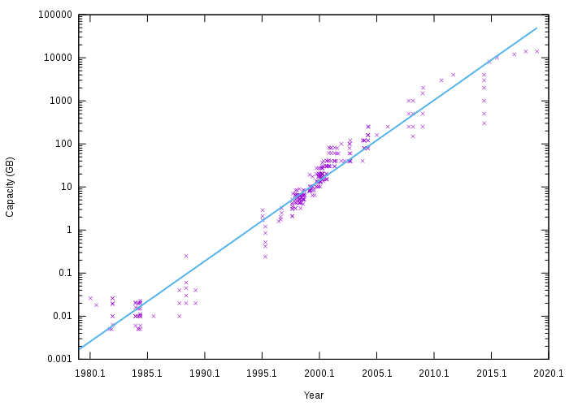

# Forewords

---

## Course outline

1. Refresher `<= Today`
2. File systems vs. databases
3. The fundamental problems of distribution
4. Distributing file systems
5. Distributing databases
6. Distributing tasks `<= Next week`
7. Parallelizing computation on distributed data
8. Statistical applications
9. Conclusions and perspectives

---

## QCM

Go on Moodle. You have 5 mins.

---

# 1. Refresher

<!-- vocabulary: cluster, node, etc. -->

---

## Storage improvement and limits

???

Storage has improved a lot, but not as fast as data size.
We generate much more data than we can store on a single hard disk.

---

.heigth600[]

---

.heigth600[]

---
## Parallelisation

???

Parallelisation is not the ideal solution, it most of the time does not bring as much improvement of a program as you might expect, since some parts of a programmed cannot be parallelised. When you parallelise, a lot of time is pent moving data around.

The map-then-reduce scheme is a clever and genral way to parallelise algorithms.

---
## Cloud computing

???

Cloud computing allows you to operate much of your computing tasks in the cloud.
In particular, you can store data too big to be stored on your personal computer.
You can launch a full cluster of machines, and arrange them as you wish, to do whatever tasks you want.
Also, they provide readily available solutions for storage and for computation at large scales.
However, this storage solutions hides a lot of the complexity that it is to store data on several computers.

---

# 2. File systems vs. databases

---

## File systems vs. databases

**Goal:** what do we do when data exceeds the physical limits of our storage?

-> We first have to understand how things are stored in the normal case.

???

Last time we did not really talk about either file systems or databases.
This will be the focus of this course.

---

## File systems

- Manages files on storage space (persistant memory, i.e. most often hard disk)
  - Makes the "physical file" (bits) and the "logical file" (fragments) transparent for the user
  - Does not care about file formats
  - Can handle _heterogeneous_, _unstructured_ data (image, sound, text, application)

- Principal use cases :
  - Read
  - Write
  - Security (access rights)

???

Transparent here means "not visible", "not disturbing".

---

## File systems

### Traditionnal file processing

.heigth600[]

---
## File Systems

### Key features

- Is responsible for the correspondance between the physical and logical file
- Maintains the **index** of where data is situated on disk
- Maintains the **namespace**, a virtual hierarchy of files and directory making it possible to identify one single file by a string, called a **path**
- Doesn't undestand file contents, only understands meta data (e.g. size, owner, time stamp of last change)
- Responsible of the integrity of files
- Responsible of the redundancy of files (_not needed on your personal computer_)
- Security (access rights)

**Provides an useful abstraction for the clients (=programmes)**. It's not the programm responsability to know how files are stored (physical location, redundancy, access right). But it's the programm responsability to know how to read files.

???

All files are just bytes for it, the FS open a stream between the file and the application which want to read it. The application know how to read it.

---

## Data bases

- Manages files on storage space (persistant memory, i.e. most often hard disk)
  - Makes the "physical file" (bits) and the "logical file" (fragments) transparent for the user
  - Possibly care about data format (numbers, texts, dates...)
  - Can handle _homogeneous_, _structured_ data

- Principal use cases :
  - Unique entry point to access data
  - Knows how to read/write data
  - Exposes new tools to manipulate data
      - Specific lanquage (SQL for instance)
      - Transactions and concurrency management
      - Models to organize data

???

We mix the database (storage part) and the DBMS (management system). It's not a mistake, just a simplification.

---

## Data bases

### Why use a data base ?

- Integrated tool to process data
- "Centralize" the data

---

## Data bases

## Data base processsing

---

## Data base transaction

- Data base responsibility to guarentee the coherence and validity of data
- **Transaction** : unit of work
  - Atomicity : complete entirely or not at all
  - Consistency : changes affected data only in allowed ways
  - Isolation : must no affect other transacations
  - Durability : changes must be written on persistant storage 

NOW WE'RE READY! BUCKLE UP YOUR BELTS!

<!-- GIF -->
---
# 2. The fundamental problems of distribution

When dealing with distributed systems, hardware failure is the norm, rather the exception.

Imagine 100 machines storing information or performing computation. There will probably at least be a couple of them not working at any moment in time. Thus, **fault-tolerance** is a core requirement.

**Latency**: you don't want to wait for hours to get answered

**Availability:** <!--???????-->

**Throughput:** <!--???????-->

**Redundancy**: keep copies of the data in far away nodes, so that you don't lose information under hardware failure

**Coherence:** <!--???????-->

**Consistency:** <!--???????-->

**Scalability:** (under constraint of constant / acceptably-increasing request time)

1. number of files / size of files
2. number of requests

1. number of nodes ; 2. number of files ; 3. size of files ; 4. number of requests.

In this part we do not distinguish between file systems and databases.

Homegeneous (all run with the same sowftware / OS) vs. inhomogeneous (diff. software / OS).

> Confidentiality, availability and integrity are the main keys for a secure system.

> High availability: the cluster can contain thousands of file servers and some of them can be down at any time
> A server belongs to a rack, a room, a data center, a country, and a continent, in order to precisely identify its geographical location
> The size of a file can vary from many gigabytes to many terabytes. The file system should be able to support a massive number of files
> The need to support append operations and allow file contents to be visible even while a file is being written
> Communication is reliable among working machines: TCP/IP is used with a remote procedure call RPC communication abstraction. TCP allows the client to know almost immediately when there is a problem and a need to make a new connection.

Load Balancing
Load Rebalancing

5.1	Confidentiality
5.2	Integrity
5.3	Availability vs. Replication

**Source:** https://en.wikipedia.org/wiki/Distributed_file_system_for_cloud

> Distributed file systems may aim for "transparency" in a number of aspects. That is, they aim to be "invisible" to client programs, which "see" a system which is similar to a local file system. Behind the scenes, the distributed file system handles locating files, transporting data, and potentially providing other features listed below.
> 
> Access transparency: clients are unaware that files are distributed and can access them in the same way as local files are accessed.
> Location transparency: a consistent namespace exists encompassing local as well as remote files. The name of a file does not give its location.
> Concurrency transparency: all clients have the same view of the state of the file system. This means that if one process is modifying a file, any other processes on the same system or remote systems that are accessing the files will see the modifications in a coherent manner.
> Failure transparency: the client and client programs should operate correctly after a server failure.
> Heterogeneity: file service should be provided across different hardware and operating system platforms.
> Scalability: the file system should work well in small environments (1 machine, a dozen machines) and also scale gracefully to bigger ones (hundreds through tens of thousands of systems).
> Replication transparency: Clients should be unaware of the file replication performed across multiple servers to support scalability.
> Migration transparency: files should be able to move between different servers without the client's knowledge.

**Souce:** https://en.wikipedia.org/wiki/Clustered_file_system#Distributed_file_systems

---
# 3. Distributing file systems

???

**Source:**

- https://en.wikipedia.org/wiki/Clustered_file_system#Distributed_file_systems
- https://en.wikipedia.org/wiki/Distributed_file_system_for_cloud

---

## Distributing file systems

**Distributed file systems** are also known historically as **network file systems**

Dates back from the beginning of "the network" in the 1960s.

In 1985, Sun Microsystems creates "Network File System" (NFS), still in use today.

---

## Specific problems of distributed file systems

> The difference between a distributed file system and a distributed [database] is that a distributed file system allows files to be accessed using the same interfaces and semantics as local files.

Such semantics include using folder-like hierarchy, attributing permissions to individual files, copying files to different locations, etc.

---
## An exemple of distributed file system: HDFS

HDFS stands for "Hadoop Distributed File System."

It is an open-source project financed by the Apache Fundation.

.footnote[

This section is heavily inspired from HDFS documentation pages ([link](https://hadoop.apache.org/docs/stable/hadoop-project-dist/hadoop-hdfs/HdfsDesign.html)). Asterisks (*) denote (almost) exact citations.

]

???

**Sources:**

- https://en.wikipedia.org/wiki/Apache_Hadoop (the explanation seems to be about Hadoop v1 since HDFS is refered to as the job tracker)
- https://hadoop.apache.org/docs/stable/hadoop-project-dist/hadoop-hdfs/HdfsDesign.html

---

## An exemple of distributed file system: HDFS

_Hadoop_ is actually a complete suite of _modules_, of which HDFS and YARN are the basic components.

But "_Hadoop_" in a broader sense refers to a complete software ecosystem, most of which is also supported by the Apache fundation. This ecosystem encompasses the _Hodoop_ modules MapReduce, Ozone and Submarine, and the libraries Ambari, Avro, Cassandra, Chukwa, HBase, Hive, Mahout, Pig, Spark, Tez and ZooKeeper. More information on [Hadoop's website](https://hadoop.apache.org).

---

.footnote[

**Source:** https://www.oreilly.com/library/view/apache-hive-essentials/9781788995092/e846ea02-6894-45c9-983a-03875076bb5b.xhtml

]

???

<!-- CHECK : what do the libraries mentionned on the previous slide do, that are not displayed on this table (e.g. Tez)  ? Conversely, what are the software mentionned in this table that are not in the previous list (e.g. Flume) ? -->

---

## An exemple of distributed file system: HDFS

_Hadoop_ was first released in 2006, and has evolved a lot since.

HDFS's developement was inspired by the publication of _Google File System_, a now deprecated file system developped by Google, to serve as infrastructure for the _Apache Nutch_ web search engine project.<!-- CHECK : now deprecated ?-->

We will here focus on the latest version, Hadoop 3.

.footnote[_Hadoop_ is mostly coded in _Java_.]

---

## An exemple of distributed file system: HDFS

### Why HDFS?

- open-source

- well-documented

- well-spread

---

## An exemple of distributed file system: HDFS

### The architecture

HDFS has a master/slave architecture.

**NameNode:** a master server that manages the file system namespace and regulates access to files by clients*

**DataNodes:** slaves which manage storage attached to the nodes that they run on*

---

## An exemple of distributed file system: HDFS

### Key ideas

When given a new file, the **NameNode** splits it into one or more **blocks** and gives these blocks to be stored into a set of **DataNodes**. Each block is stored several times, on different DataNodes, and this number is the **replication factor** of that file.*

**Files in HDFS cannot be modified**, except for appends and truncates. Emphasis is indeed on the reading part, a scheme HDFS calls "write-once-read-many".

By default, the replication factor is 3, and the NameNode tries to allocate the replicas intelligently: one on a given node, that then sends a copy to a close node (faster but less fault-tolerant) and an other to a further away node (slower but more fault-tolerant).

---

## An exemple of distributed file system: HDFS

### Key ideas

If a client wants to write a file, they ask the NameNode.

1. The NameNode splits the file into blocks.
2. For each block, it selects a number of DataNode to write onto (typically 3), based on:
  
    a. disk space (more space is better)
    b. proximity to the client (closer is better)
    c. proximity to each other (one replication close, one far)
    d. distribution of blocks (blocks of the same file should be on different nodes)
  
3. It then passes the block split and the lists to the client.
4. The client writes each block on the first block on the list.
5. The DataNode passes the block and the list on to the next DataNode on the list. (This minimizes the use of the network in between the cluster and the client, likely to be slower than the network inside the cluster.)

.footnote[The "client" is often not directly the user, but some other module asking for read / write access.]

---

## An exemple of distributed file system: HDFS

### Key ideas

If a client wants to read a file, they ask the NameNode.

1. The NameNode looks into the index to associate the file path to blocks.
2. The NameNode locates DataNodes containing the blocks, closest to the client.
3. It passes the information to the client, who in turn reads directly from the specified DataNodes.

.footnote[The "client" is often not directly the user, but some other module asking for read / write access.]

---

## An exemple of distributed file system: HDFS

### Role of the master (nodename)

The **NodeName** :

- is the entry point for a client's requests
- decides how to split files into blocks and on which DataNodes to store these blocks
- never handles actual files, only stores metadata
- knows at any time the correspondance between a file's name and the block's identifiers (aka **namespace**, stored on disk) and the the physical location of blocks (aka **block index**, kept in memory)
- detects DataNode failure by listenning to their **heartbeat** and demands block replication as necessary

???

It periodically receives a Heartbeat and a Blockreport from each of the DataNodes in the cluster. Receipt of a Heartbeat implies that the DataNode is functioning properly. A Blockreport contains a list of all blocks on a DataNode.
- splits 
- manages and stores the data registry

The NameNode is the arbitrator and repository for all HDFS metadata. The system is designed in such a way that user data never flows through the NameNode.*

The number of copies of a file is called the replication factor of that file. This information is stored by the NameNode.*

---

## An exemple of distributed file system: HDFS

### Role of the master (nodename)

The NameNode executes file system namespace operations like opening, closing, and renaming files and directories. It also determines the mapping of blocks to DataNodes.*

The **namespace** is persisted to disk at regular intervals (every X seconds or every Y changes). In between, a record of the changes is also written onto disk, in a file know as the edit log, so that at all time, the entire file system is preserved. In a case of a failure of the master, the data on disk is restored.

_Where_ exactly the blocks are stored, however, is not stored on disk, but kept in memory.

---

## An exemple of distributed file system: HDFS

### Role of the slaves

The DataNodes are responsible for serving read and write requests from the file system’s clients. The DataNodes also perform block creation, deletion, and replication upon instruction from the NameNode.*

**DataNodes:**
- emit a regular **heartbeat** containing the list of all the blocks stored locally
- send copies directly to each other when the NameNode requires a copy to be made
- give access (in read or write) directly to the client

---

## An exemple of distributed file system: HDFS

### Properties

#### Fault-tolerance

> The primary objective of HDFS is to store data reliably even in the presence of failures. The three common types of failures are NameNode failures, DataNode failures and network partitions.

---

## An exemple of distributed file system: HDFS

### Properties

#### Fault-tolerance

1. Hadoop modules have **location awareness**, i.e. they use the locations of the nodes relative to each other. This enables HDFS to obtain **safe redundancy** by replicating data in different locations. By default, there is one copy in vicinity (typically in a server room, the same rack) and one copy in further away (typically, an other rack).

2. Failure is explicitly taken into account in the design of the file syste. There may be 3 kinds of failure:
  
  - **NameNode failure:** when the NameNode fails, it is restarted, and:
    
      - restores the latest index saved on disk,
      - applies all the changes that are recorded in the edit log, also saved on disk
      - reconstitute the location of blocks in memory from the DataNodes' heartbeat
    
    Running several NameNodes with a distritbuted edit log is also possible.
    
  - **Network failure:** when a subset of DataNodes lose connectivity with the NameNode (aka _network partition_), the NameNode detects the absence of _heartbeat_ and immediately demands replication of blocks below the replication factor. Since replication happens in distinct locations, it is unlikely that all of the replicated blocks become unavailable. (By default, a DataNode is considered dead after 10 min of silence.)
  - **DataNode failure:** this is a special case of _network partition_ with only one node disconnected from the rest

---

## An exemple of distributed file system: HDFS

### Properties

#### Availability

1. In some cases, user requests may start to concentrate on only a few NameNodes, and cause over-load and slow-down. Maybe a specific file is requested particularly often. Or maybe some DataNodes are full, whereas some other are almost empty — this might happen because you just added a new node, or because you deleted some voluminous file. HDFS is compatible with _rebalancing_ (i.e. moving data blocks from over-used nodes to under-used ones, or replicating often-requested blocks), even though it is not implemented by default as of today.

2.

3.

---

## An exemple of distributed file system: HDFS

### Properties

#### Scalability

1. By splitting files into blocks, HDFS does not limit the size of a single file.
2. <!-- multiple files -->
3. <!-- multiple nodes -->
4. <!-- multiple users -->

**Scalability** is guaranteed by ... . It is designed to be able to store datasets reaching possibly To in size, and possibly tens of millions of files. The number of nodes should not matter.

However, HDFS is not meant for frequent writes, and does not scale in this regard. Indeed, even though data does not go through the DataNode, editting the index — which is, please remember, copied onto disk — and demanding copies to be made to the DataNodes take time. Multiple NameNode can cope with this but is not the standard installation. HDFS calls it "write-once-read-many".

---

## An exemple of distributed file system: HDFS

### Properties

#### Integrity

HDFS insures integrity by storing the _**checksum**_ of a block alongside the block itself. If the block gets corrupted, the computed checksum does not match the stored one. (It is possible, but much less likely, that the checksum itselft gets corrupted.)

Clients checksum the block they download and inform the DataNode of the result. DataNodes also run regular checsksum of all unchecked blocks.

DataNodes store information about the checks already made, and thus can narrow the date about which data has become corrupted.

In case of checksum mismatch, clients flag the incriminated block as corrupted to the NameNode, in which case a new copy is demanded.

---

**High throughput** is obtained at the expense of a (relatively) **low latency**. HDFS is not conceived for interactive use.

**High throughput access** <!--????--> is guaranteed by ...

How this specific architecture acheives fault-tolerance, etc.

---
## Other distributed file systems

- Proprietary private file systems such Amazon S3, Azure Storage, Google Cloud Storage, etc.
- **NFS** (Linux), **SMB** (Windows) or **AFP** (Apple), typically used in Network-attached storages (NAS's)
- **Lustre**, typically used in clusters of super computers
- ...

???

**Source:**https://en.wikipedia.org/wiki/Comparison_of_distributed_file_systems 

<!--Highlight some differences?-->

> Network File System (NFS) uses a client-server architecture, which allows sharing files between a number of machines on a network as if they were located locally, providing a standardized view. The NFS protocol allows heterogeneous clients' processes, probably running on different machines and under different operating systems, to access files on a distant server, ignoring the actual location of files. Relying on a single server results in the NFS protocol suffering from potentially low availability and poor scalability. Using multiple servers does not solve the availability problem since each server is working independently.[5] The model of NFS is a remote file service. This model is also called the remote access model, which is in contrast with the upload/download model:
> Remote access model: Provides transparency, the client has access to a file. He send requests to the remote file (while the file remains on the server).[6]
> Upload/download model: The client can access the file only locally. It means that the client has to download the file, make modifications, and upload it again, to be used by others' clients.
> The file system used by NFS is almost the same as the one used by Unix systems. Files are hierarchically organized into a naming graph in which directories and files are represented by nodes.

---
# 4. Distributing databases

https://en.wikipedia.org/wiki/Distributed_database

.footnote[This section is heavily inspired from « Cassandra: The Definitive Guide: Distributed Data at Web Scale. » by Jeff Carpenter]

---
## Specific problems of distributed databases

A key feature of (relational) databases is their **consistency**.

For instance, if your schema requires an foreign key, you are not allowed to add a line to a given table without linking to a record from an other table.

However, when distributing databases, it becomes increasingly difficult to maintain **consistency** accross copies of many tables. Indeed, the mere lookup of a foreign key in a table distributed across many nodes may take a long time, and one is supposed to do so for each record created / updated.

In order to maintain **consistency**, databases thus generally give up the relational component, and are thus known as **no-SQL databases**.

Doing so, they become mere **distributed data stores**, and the frontier with a file system tends to blur. They often consist in just a requesting programme and an interface with the underlying file system.

Distributed transactions

---
## Specific solutions for distributed databases

### Denormalisation

When data becomes large, join operations becomes expensive. (So do consistency checks on foreign keys.)

A solution is to pre-compute joins, so that the lookup is performed only once. This is knokwn as denormalisation.

But then maintaining consistency accross the tables become a problem.

---
## Specific solutions for distributed databases

### 2 phase-commit

In order to maintain schema-consistency, you lock a resource until you finished the transaction.

Downsides:

- The resource is locked in between, preventing other clients to access it. It is thus only acceptable for transactions occuring super fast.
- Infinite waiting is possible.

---
## Specific solutions for distributed databases

### Compensation

In order to maintain schema-consistency, you undo a previously done change, in case that the transaction finally ends up with an error. Like soustracting -10 if you initially did +10.

Downsides:

- does not work for legally binding transactions (stock sales, bank transfers...)

---
## Specific solutions for distributed databases

### Sharding

<!-- read more -->

Sharding is the idea to split data over multiple nodes.

1. functionnal segmentation
2. (manual) key-based sharding
3. lookup-table

Downsides of look-up tables:

- the lookup table is a single point of failure
- every request goes through the lookup table

---
## Specific solutions for distributed databases

### _share-nothing_ architecture

A _share-nothing_ architecture is an architecure where each node is independant from each other, so that consistency becomes irrelevant.

.footnote[Michael Stonebraker, 1986, "The Case for Shared Nothing."]

---
## Specific solutions of distributed databases

### No-SQL databases

If we accept some departure from the ACID requirement, it is possible to reach (horizontal) scalability and high availability though distribution.

This has always existed, but the unifying "no-SQL" labels was a 2010s phenomenon.

- key-value store (ex: ????)
- column store (ex: Cassandra)
- document store (ex: MongoDB)
- graph database (ex: Neo4J)

---
## Specific solutions of distributed databases

### Issues over consistency

- strict consistency means every node containing the data gets updated simultaneously ; this means that there is some global time that the nodes can refer to ; and that they can agree in a sure way that some change will be acknowledged at a given instant (and that the other nodes know that this node knows that hey know it knows... ¹) ; the only way to insure this form of consistency is through locking-releasing resources
- causal consistency <!-- ??? -->
- weak consistency, changes will propagate through the nodes until, at some point in time, consistency will be achieved

.footnote[¹ This is known as **the Byzantine Generals Problem**, where to generals refuse to attack until they get completely sure that the other is also sure that they both agree to attack.]

---
## Specific solutions of distributed databases

### Summary

- Consistency & Availability:
    Such database 

- Availability & Fault-tolerance:

- Fault-Tolerance & Consistency:
    If you shard your data to distribute it across several nodes.

> « We encounter scalability problems when our relational applications become successful and usage goes up. Joins are inherent in any relatively normalized relational database of even modest size, and joins can be slow. The way that databases gain consistency is typically through the use of transactions, which require locking some portion of the database so it’s not available to other clients. This can become untenable under very heavy loads, as the locks mean that competing users start queuing up, waiting for their turn to read or write the data. »

Extrait de: Jeff Carpenter. « Cassandra: The Definitive Guide: Distributed Data at Web Scale. »

> « We encounter scalability problems when our relational applications become successful and usage goes up. Joins are inherent in any relatively normalized relational database of even modest size, and joins can be slow. The way that databases gain consistency is typically through the use of transactions, which require locking some portion of the database so it’s not available to other clients. This can become untenable under very heavy loads, as the locks mean that competing users start queuing up, waiting for their turn to read or write the data. »

Extrait de: Jeff Carpenter. « Cassandra: The Definitive Guide: Distributed Data at Web Scale. » Apple Books. 

> « We encounter scalability problems when our relational applications become successful and usage goes up. Joins are inherent in any relatively normalized relational database of even modest size, and joins can be slow. The way that databases gain consistency is typically through the use of transactions, which require locking some portion of the database so it’s not available to other clients. This can become untenable under very heavy loads, as the locks mean that competing users start queuing up, waiting for their turn to read or write the data. »

« We encounter scalability problems when our relational applications become successful and usage goes up. Joins are inherent in any relatively normalized relational database of even modest size, and joins can be slow. The way that databases gain consistency is typically through the use of transactions, which require locking some portion of the database so it’s not available to other clients. This can become untenable under very heavy loads, as the locks mean that competing users start queuing up, waiting for their turn to read or write the data. »

Extrait de: Jeff Carpenter. « Cassandra: The Definitive Guide: Distributed Data at Web Scale. » Apple Books. 

« The problems that 2PC introduces for application developers include loss of availability and higher latency during partial failures. Neither of these is desirable. So once you’ve had the good fortune of being successful enough to necessitate scaling your database past a single machine, you now have to figure out how to handle transactions across multiple machines and still make the ACID properties apply. Whether you have 10 or 100 or 1,000 database machines, atomicity is still required in transactions as if you were working on a single node. But it’s now a much, much bigger pill to swallow. »

Extrait de: Jeff Carpenter. « Cassandra: The Definitive Guide: Distributed Data at Web Scale. » Apple Books. 

Extrait de: Jeff Carpenter. « Cassandra: The Definitive Guide: Distributed Data at Web Scale. » Apple Books. 

???

**Source:**

- https://en.wikipedia.org/wiki/Denormalization
- Cassandra, the definitive guide

---
## An exemple of distributed database: Cassandra

Cassandra has integration with the Hadoop ecosystem.

Cassandra introduced the Cassandra Query Language (CQL). CQL is a simple interface for accessing Cassandra, as an alternative to the traditional Structured Query Language (SQL).
Eventual Consistency
Cassandra manages eventual consistency of reads, upserts and deletes through Tombstones.

Some of the largest production deployments include Apple's, with over 75,000 nodes storing over 10 PB of data, Netflix (2,500 nodes, 420 TB, over 1 trillion requests per day), Chinese search engine Easou (270 nodes, 300 TB, over 800 million requests per day), and eBay (over 100 nodes, 250 TB).

Born in Facebook in 2007, bases its distribution design on Amazon’s Dynamo and its data model on Google’s Bigtable.

.footnote[

]

???

Distributed
Every node in the cluster has the same role. There is no single point of failure. Data is distributed across the cluster (so each node contains different data), but there is no master as every node can service any request.
Supports replication and multi data center replication
Replication strategies are configurable.[16] Cassandra is designed as a distributed system, for deployment of large numbers of nodes across multiple data centers. Key features of Cassandra’s distributed architecture are specifically tailored for multiple-data center deployment, for redundancy, for failover and disaster recovery.
Scalability

---
## An exemple of distributed database: Cassandra

### Key ideas

Cassandra is **decentralized**: it is a peer-to-peer database, at the opposite spectrum of the a master-slave architecture. Each node functions exactly the same as the other, and no single one is necessary to the overall functionning of the database.

The nodes maintain ... through gossip.

Cassandra has innate balancing and rebalancing capabilities in the case of adding or removing nodes (**elasticity**).

Cassandra is always writable, and reads are not always successful, and there is not guarantee that data will be up to date.

Cassandra has 2 parameters: replication factor and consistency level. As in HDFS, replication factor is number of copies the database has to maintain. Consistency level is specified at each interaction: it is the number of nodes the databse has to consult and that have to agree for the operation to be considered a success.

<!-- DO: add something about single point of failure in introduction -->

Cassandra is a **sparse**, **row-oriented** database, meaning that not all columns should exist for each record. Each row gets a key, that is used to distribute and replicate the records.This allows Cassandra to save space of non-assigned values.

Cassandra uses **location awareness**, and distinguishes between two levels: the rack, and the data center.

<!-- flexible schema -->

---
## An exemple of distributed database: Cassandra

### Key ideas

When a clients wants to write, he adresses himself to any of the nodes, while specifying a desired consistency level.

1. The node becomes coordinator for this request.
2. The coordinator forwards the request to all the <!--known?--> replicas hosting the nodes.
3. The replica logs the request in its "commit log" on disk, performs the write in memory, then confirms the transaction success.
4. The coordinator waits for as many confirmations as the client has requested with its consistency level before confirming the writing.

---
## An exemple of distributed database: Cassandra

### Key ideas

When a clients want to read from Cassandra, he adresses himself to any of the nodes.

1. The node becomes coordinator for this request.
2. The coordinator forwards the request to all the <!--known?--> replicas hosting the nodes.
1. The node launches a "snitch" (FR: cafteur), whose task is to find the fastest available node having the requested records
2. The client downloads the records.
3. Simmultaneously, the node asks for the checksums of the same records from the other (slower) nodes that contain the same data. As many checksums are askes as the consistency level specified in the request.

---
## An exemple of distributed database: Cassandra

### Replicas

when an write instruction is given, a replica:

1. logs it in a log (called "commit log")
2. pushes the changes in memory ("memtable")
3. if the current memtable reaches a threshold, creates a new memtable
4. when idle, copies the memtable to disk

### Gossipping

Once per second, a node will send a message to a random node of the cluster.

If the node does not answer, it marks it locally as down.

<!--Not so clear...-->

.footnote[The term "gossip protocol" dates back from 1987, in an article by Alan Demers.]

---

## An exemple of distributed database: Cassandra

### Properties

#### Fault-tolerance

Data is automatically replicated to multiple nodes for fault-tolerance. Replication across multiple data centers is supported. Failed nodes can be replaced with no downtime.

---
## An exemple of distributed database: Cassandra

### Properties

#### Scalability

Designed to have read and write throughput both increase linearly as new machines are added, with the aim of no downtime or interruption to applications.

---
## An exemple of distributed database: Cassandra

### Properties

#### Consistency

Cassandra is typically classified as an AP system, meaning that availability and partition tolerance are generally considered to be more important than consistency in Cassandra,[17] Writes and reads offer a tunable level of consistency, all the way from "writes never fail" to "block for all replicas to be readable", with the quorum level in the middle.[18]

---
# 5. Distributing tasks

---
## Specific problems of distributed task management

vocabulary: job, task...

https://en.wikipedia.org/wiki/Scheduling_(computing)

---
## An exemple of job-scheduler: YARN

???

**Sources:**

- https://en.wikipedia.org/wiki/Apache_Hadoop

### The architecture

---
### Role of the master (job scheduler)

---
### Role of the slaves

---
### Properties

**Fault-tolerance** is guaranteed by ...

**Scalability** is guaranteed by ...

How this specific architecture acheives fault-tolerance, etc.

Hadoop has **location awareness**, i.e. it uses the locations of the nodes relative to each other, in order to allocate the data to the closest nodes.

## Other job-schedulers

---
### Python's Celery

http://www.celeryproject.org/
https://github.com/celery/celery
https://en.wikipedia.org/wiki/Celery_(software)

---
# 5. Parallezing compution on distributed data

---
## Map-reduce principle

---
## Map-shuffle-reduce principle

---
## An exemple of parallelized computation framework: Spark

---
## Other frameworks

---
# 6. Statistical applications

---
# 7. Conclusions and perspectives

---
## What to remember from today?

---
## What to remember from the course?

Is big data a problem for you?
Is it worth it?

Key insights:
- use sampling
- maybe you can afford waiting
- beware of the cost
- low level is faster
- think befor you do

---
## Now you understand this:

--> quotes explaining what this or this software is

<!-- fast languages must be moved to the first course:
Fast languages (Go, Julia, JavaScript) -->

<!--

THINGS TO ADD SOMEWHERE:

From Wikipedia:

"The master node consists of a Job Tracker, Task Tracker, NameNode, and DataNode."
"A slave or worker node acts as both a DataNode and TaskTracker, though it is possible to have data-only and compute-only worker nodes."
Communication between the nodes happens in SSH.
"In a larger cluster, HDFS nodes are managed through a dedicated NameNode server to host the file system index, and a secondary NameNode that can generate snapshots of the namenode's memory structures, thereby preventing file-system corruption and loss of data."

From https://hadoop.apache.org/docs/stable/hadoop-project-dist/hadoop-hdfs/HdfsDesign.html

HDFS relaxes a few POSIX requirements to enable streaming access to file system data.
HDFS applications need a write-once-read-many access model for files. A file once created, written, and closed need not be changed except for appends and truncates. Appending the content to the end of the files is supported but cannot be updated at arbitrary point. This assumption simplifies data coherency issues and enables high throughput data access. A MapReduce application or a web crawler application fits perfectly with this model.
A computation requested by an application is much more efficient if it is executed near the data it operates on. This is especially true when the size of the data set is huge. This minimizes network congestion and increases the overall throughput of the system. The assumption is that it is often better to migrate the computation closer to where the data is located rather than moving the data to where the application is running. HDFS provides interfaces for applications to move themselves closer to where the data is located.
To minimize global bandwidth consumption and read latency, HDFS tries to satisfy a read request from a replica that is closest to the reader.

The HDFS architecture is compatible with data rebalancing schemes. A scheme might automatically move data from one DataNode to another if the free space on a DataNode falls below a certain threshold. In the event of a sudden high demand for a particular file, a scheme might dynamically create additional replicas and rebalance other data in the cluster. These types of data rebalancing schemes are not yet implemented.

-->