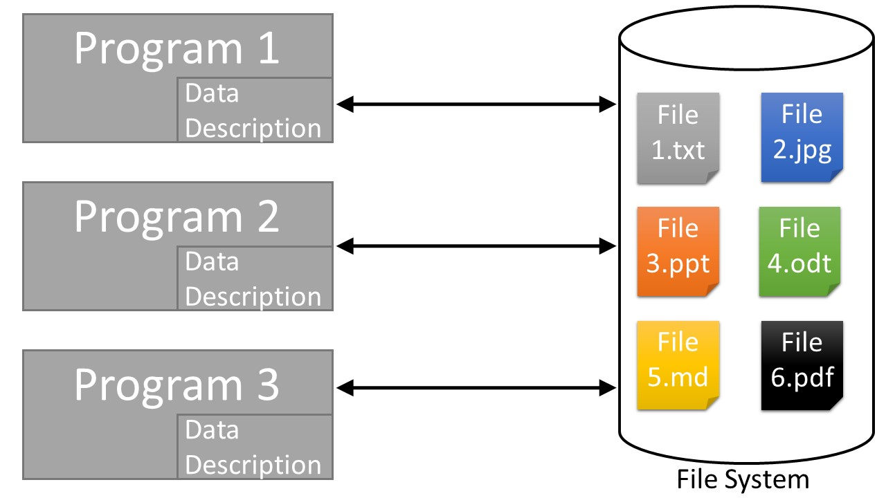

# 1. Refresher

vocabulary: cluster, node, etc.

---
## Storage improvement and limits

---
## Parallelisation

---

## File systems (FS)

- Manages files on persistant memory
  - Makes transparent the "physical file" and the "logical file" for the user
  - Heterogeneous unstructured data (image, sound, text, application)
- Principal use cases :
  - Read
  - Write
  - Security (access right)

---
## Traditionnal file processing

---
## File System key features
- Bonds the physical file (electro-magnetic field on your hardrive) and the logical file (list of bits)
  - **Namespace** : file name (must be unique)
  - **Index** : map files name and physical location on disk
- Doesn't undestand files content
- Responsible of the integrity of files
- Responsible of the redundancy of files
- Security (access right)
- Metadata
- Hierachy of files and directory

**Provide an abstraction for the users**. It's not the programm responsability to know how files are stored (physical location, redundancy, access right). But it's the programm responsability to know how to read files.

???
All files are just bytes for it, the FS open a stream between the file and the application which want to read it. The application know how to read it.

---
## Data base

- Manages file on persistant memory
  - Makes transparent the "physical file" and the "logical file" for the user
  - "Homogenous structured" data
- Principal use cases :
  - Unique entry point to access data
  - Knows how to read/write data
  - Exposes new tools to manipulate data
      - Specific lanquage (SQL for instance)
      - Transactions and concurrency management
      - Models to organize data

???
We mix the database (storage part) and the DBMS (management system). It's not a mistake, just a simplification.

---
## Why use a data base
- Integrated tool to process data
- "Centralize" the data

---
## Data base processsing

---
## Data base transaction

- Data base responsibility to guarentee the coherence and validity of data
- **Transaction** : unit of work
  - Atomicity : complete entirely or not at all
  - Consistency : changes affected data only in allowed ways
  - Isolation : must no affect other transacations
  - Durability : changes must be written on persistant storage 

---
## Cloud computing

NOW WE'RE READY! BUCKLE UP YOUR BELTS!

<!-- GIF -->
---
# 2. The fundamental problems of distribution

In this part we do not distinguish between file systems and databases.

Homegeneous (all run with the same sowftware / OS) vs. inhomogeneous (diff. software / OS).

---
# 3. Distributing file systems

---
## Specific problems of distributed file systems

---
## An exemple of distributed file system: HDFS

HDFS stands for "Hadoop Distributed File System."

It is an open-source project financed by tha Apache Fundation.

???

**Sources:**

- https://en.wikipedia.org/wiki/Apache_Hadoop

---
### Why HDFS?

---
### The architecture

---
### Role of the master (nodename)

---
### Role of the slaves

---
### Properties

How this specific architecture acheives fault-tolerance, etc.

---
## Other job-schedulers

---
# 4. Distributing databases

https://en.wikipedia.org/wiki/Distributed_database

---
## Specific problems of distributed databases

---
## An exemple of distributed database: ???????????

---
# 5. Distributing tasks

---
## Specific problems of distributed task management

vocabulary: job, task...

https://en.wikipedia.org/wiki/Scheduling_(computing)

---
## An exemple of job-scheduler: YARN

---
### The architecture

---
### Role of the master (job scheduler)

---
### Role of the slaves

---
### Properties

Howthis specific architecture acheives fault-tolerance, etc.

---
## Other job-schedulers

---
### Python's Celery

http://www.celeryproject.org/
https://github.com/celery/celery
https://en.wikipedia.org/wiki/Celery_(software)

---
# 5. Parallezing compution on distributed data

---
## Map-reduce principle

---
## Map-shuffle-reduce principle

---
## An exemple of parallelized computation framework: Spark

---
## Other frameworks

---
# 6. Statistical applications

---
# 7. Conclusions and perspectives

---
## What to remember from today?

---
## What to remember from the course?

Is big data a problem for you?
Is it worth it?

Key insights:
- use sampling
- maybe you can afford waiting
- beware of the cost
- low level is faster
- think befor you do

---
## Now you understand this:

--> quotes explaining what this or this software is

<!-- fast languages must be moved to the first course:
Fast languages (Go, Julia, JavaScript) -->