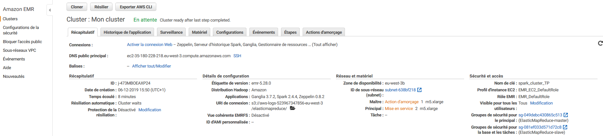

# Créer un cluster Spark avec EMR (Elastic Map Reduce) et s'y connecter

## Créer un cluster spark avec EMR

- [ ] Connectez-vous à Amazon AWS
- [ ] Sélectionnez le service EMR 

- [ ] Cliquez sur le bouton "Créer un cluster"

  - [ ] Donner le nom que vous voulez à votre cluster, par exemple Spark-TPX avec X le numéro du TP
  - [ ] Laissez sélectionnée la journalisation. Cette option permet  votre cluster de stocker les log (journaux) de votre application sur votre espace S3 et ainsi faciliter le débogage. Comme vos log sont stockée sur S3, Amazon va vous facturer le stockage. Le prix de stockage sur S3 est extrêmement faible (0,023$ par Go par mois si vous avez moins de 50To), mais il peut être intéressant d'allez nettoyer vos vieilles log de temps en temps.
  - [ ] Configuration des logiciels
    - [ ] Laissez la version d'emr par défaut
    - [ ] Sélectionnez comme application Spark
  - [ ] Configuration du matériel
    - [ ] Type d'instance : m5.xlarge (4 cores avec une fréquence max de 3,1 GHz d'un Intel Xeon Platinum série 8000 avec 16Go de Ram). Prix total de 0.272$/h par instance
    - [ ] 3 Instances
  - [ ] Sécurité et accès
    - [ ] Sélectionnez une clef SSH que vous avez déjà généré ou allez en générer une autre
    - [ ] Laissez le Rôle EMR et le Profil d'instance par défaut
  - [ ] Démarrer le cluster. Le démarrage peut prendre quelques minutes
  - [ ] Braco vous avez démarrer un cluster Spark en moins de 15min !
  - [ ] 

  ## Accéder  l'interface de suivi du cluster

  ### Installer FoxyProxy

  Pour accéder à l'interface de suivi il est nécessaire d'installer le plugin FoxyProxy Standard sur votre navigateur. 

  Pour google chrome : [lien](https://chrome.google.com/webstore/detail/foxyproxy-standard/gcknhkkoolaabfmlnjonogaaifnjlfnp?hl=fr)

  Pour firefox: [lien](https://addons.mozilla.org/fr/firefox/addon/foxyproxy-standard/)

  Une fois FoxyProxy installé ouvrez le plugin et importer le fichier se trouvant dans :  /settings/foxyproxy-settings.json

  ### Etablir une connection SSH avec votre cluster

  - [ ] Lancez PuTTY

  - [ ] Dans la liste Category, cliquez sur Session

  - [ ] Dans le champ Host Name, tapez **hadoop@XXXX** avec XXXX le DNS public principal de votre cluster

  - [ ] Dans la liste Category, développez Connection > SSH > Auth

  - [ ] Pour le fichier de clés privées utilisé pour l'authentification, cliquez sur Browse et sélectionnez le fichier de clés privées  utilisé pour lancer le cluster.

  - [ ] Dans la liste Category, développez Connection > SSH, puis cliquez sur Tunnels.

  - [ ] Dans le champ Source port, tapez **8157** (port local inutilisé choisi de façon aléatoire).

  - [ ] Sélectionnez les options Dynamic et Auto.

    

  - [ ] Laissez le champ Destination vide, puis cliquez sur Add.

  - [ ] Cliquez sur Open.

  - [ ] Cliquez sur Yes pour ignorer l'alerte de sécurité.

    

### Ouvrir les interfaces de suivi 

Vous pouvez désormais accéder aux interfaces de suivi du cluster

