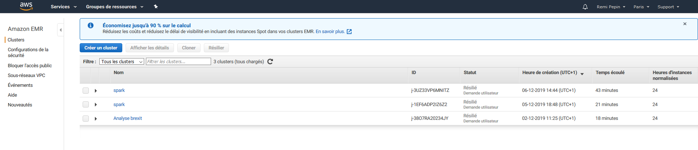
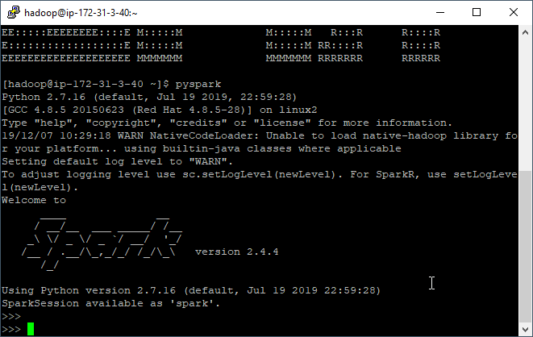
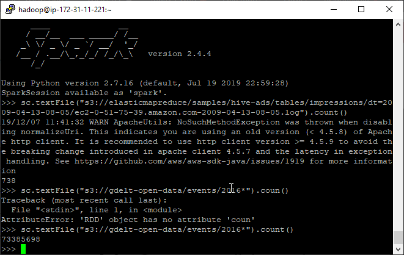
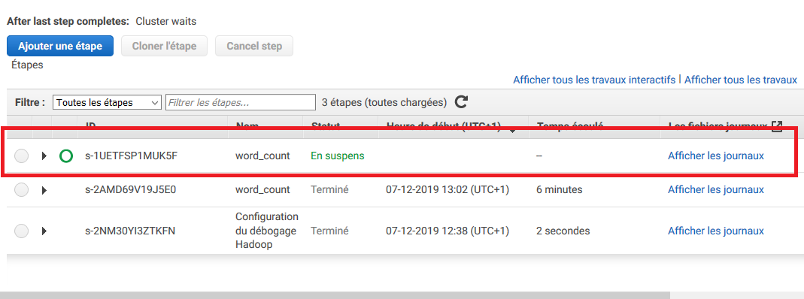

# Créer un cluster Spark avec EMR (Elastic Map Reduce) et s'y connecter

## Créer un cluster spark avec EMR

- [ ] Connectez-vous à Amazon AWS
- [ ] Sélectionnez le service EMR 



- [ ] Cliquez sur le bouton "Créer un cluster"

  - [ ] Donner le nom que vous voulez à votre cluster, par exemple Spark-TPX avec X le numéro du TP
  - [ ] Laissez sélectionnée la journalisation. Cette option permet  votre cluster de stocker les log (journaux) de votre application sur votre espace S3 et ainsi faciliter le débogage. Comme vos log sont stockée sur S3, Amazon va vous facturer le stockage. Le prix de stockage sur S3 est extrêmement faible (0,023$ par Go par mois si vous avez moins de 50To), mais il peut être intéressant d'allez nettoyer vos vieilles log de temps en temps.
  - [ ] Configuration des logiciels
    - [ ] Laissez la version d'emr par défaut
    - [ ] Sélectionnez comme application Spark
  - [ ] Configuration du matériel
    - [ ] Type d'instance : m5.xlarge (4 cores avec une fréquence max de 3,1 GHz d'un Intel Xeon Platinum série 8000 avec 16Go de Ram). Prix total de 0.272$/h par instance
    - [ ] 3 Instances (ou plus selon vos envies et votre budget)
  - [ ] Sécurité et accès
    - [ ] Sélectionnez une clef SSH que vous avez déjà générée ou allez en générer une autre
    - [ ] Laissez le Rôle EMR et le Profil d'instance par défaut
  - [ ] Démarrer le cluster. Le démarrage peut prendre quelques minutes
  - [ ] Bravo vous avez démarrer un cluster Spark en moins de 15min !
  - [ ] 

  ## Accéder à l'interface de suivi du cluster

  ### Installer FoxyProxy

  Pour accéder à l'interface de suivi il est nécessaire d'installer le plugin FoxyProxy Standard sur votre navigateur. 

  Pour google chrome : [lien](https://chrome.google.com/webstore/detail/foxyproxy-standard/gcknhkkoolaabfmlnjonogaaifnjlfnp?hl=fr)

  Pour firefox: [lien](https://addons.mozilla.org/fr/firefox/addon/foxyproxy-standard/)

  Une fois FoxyProxy installé ouvrez le plugin et importer le fichier se trouvant dans :  /settings/foxyproxy-settings.json

  ### Etablir une connection SSH avec votre cluster

  - [ ] Lancez PuTTY

  - [ ] Dans la liste Category, cliquez sur Session

  - [ ] Dans le champ Host Name, tapez **hadoop@XXXX** avec XXXX le DNS public principal de votre cluster

  - [ ] Dans la liste Category, développez Connection > SSH > Auth

  - [ ] Pour le fichier de clés privées utilisé pour l'authentification, cliquez sur Browse et sélectionnez le fichier de clés privées  utilisé pour lancer le cluster.

  - [ ] Dans la liste Category, développez Connection > SSH, puis cliquez sur Tunnels.

  - [ ] Dans le champ Source port, tapez **8157** (port local inutilisé choisi de façon aléatoire).

  - [ ] Sélectionnez les options Dynamic et Auto.

    

  - [ ] Laissez le champ Destination vide, puis cliquez sur Add.

  - [ ] Cliquez sur Open.

  - [ ] Cliquez sur Yes pour ignorer l'alerte de sécurité.

    
    
  - [ ] Une fois connectez en ssh à votre cluster vous pouvez lancer spark-shell ou pySpark avec
  
    ````shell
    pyspark #pour lancer pyspark
    spark-shell #pour spark-shell
    ````
  
    *Si vous préférez écrire votre code en python, il est nécessaire de lancer spark-shell avant pour charger toutes les bibliothèques java nécessaires.*
  
    
  
  - [ ] Vous pouvez désormais écrire du code spark en interactif. Par exemple voici un petit script pythonb qui compte le nombre de lignes dans un fichier public stocké sur s3.
  
    ````python
    >> sc
    <pyspark.context.SparkContext object at 0x7fe7e659fa50>
    >>> textfile = sc.textFile("s3://gdelt-open-data/events/2016*")
    >>> textfile.count()
    73385698
    ````
  
    
  
    Voici le même script scala en plus condensé
  
    ````scala
    sc.textFile("s3://gdelt-open-data/events/2016*").count()
    ````
  
    

### Ouvrir les interfaces de suivi 

Une fois la connexion shh établie, et FoxyPproxy configuré, vous pouvez désormais accéder aux interfaces de suivi du cluster.


### Lancer un job avec un script

- [ ] Upload sur S3 le script que vous voulez utiliser. Par exemple le fichier [exemple](/exemple/script_exemple.py) suivant.

- [ ] Sur l'interface de votre cluster sélectionnez l'onglet "Etape"

  

- [ ] Ajouter une étape

  - [ ] Type étape : application Spark
  - [ ] Nom de l'application : word_count
  - [ ] Mode de déploiement : cluster
  - [ ] Emplacement de l'application : allez chercher sur s3 le script uploadé plus tôt
  - [ ] "Ajouter"

  

- [ ] Vous allez voir votre script apparaitre dans les étapes de votre cluster. Son exécution peut prendre quelques minutes.

  

- [ ] Pour voir le résultat allez retournez dans la l'onglet "Récapitulatif" puis cliquez sur "Gestionnaire de ressource"

- [ ] Sur l'interface d'Hadoop sélectionnez votre application, puis en bas de la nouvelle page cliquez sur Logs

  

​	

- [ ] En bas de la page de log vous trouverez votre résultat


### Se connecter avec Rstudio et sparklyR

- [ ] Se connecter en SSH à votre cluster EMR

- [ ] Installer Rstudio server

  ````shell
  sudo yum install libcurl-devel openssl-devel # used for devtools
  wget -P /tmp https://s3.amazonaws.com/rstudio-dailybuilds/rstudio-server-rhel-0.99.1266-x86_64.rpm
  sudo yum install --nogpgcheck /tmp/rstudio-server-rhel-0.99.1266-x86_64.rpm
  ````

  

  

- [ ] Créer un user pour Rstudio

  ````shell
  # Make User
  sudo useradd -m rstudio-user
  sudo passwd rstudio-user
  ````

- [ ] Créer un dossier dans HDFS pour votre user

  ````shell
  # Create new directory in hdfs
  hadoop fs -mkdir /user/rstudio-user
  hadoop fs -chmod 777 /user/rstudio-user
  ````

- [ ] Connecter vous à l'interface web de Rstudio server avec l'adresse suivante https://master-node-public-DNS:8787 puis connectez vous avec l'utilisation rstudio-user et le mot de passe que vous avez choisi.

- [ ] Vous pouvez commencer à coder. Voici un script exemple : [lien](exemple/script_exemple_R)

## Liens utiles

- [Documentation officielle spark EMR](https://docs.aws.amazon.com/fr_fr/emr/latest/ReleaseGuide/emr-spark.html)
- [Getting Started with PySpark on AWS EMR](https://towardsdatascience.com/getting-started-with-pyspark-on-amazon-emr-c85154b6b921)

- [Creating PySpark DataFrame from CSV in AWS S3 in EMR  ](https://gist.github.com/jakechen/6955f2de51212163312b6430555b8e0b)

- [Connection avec Rstudio](https://spark.rstudio.com/examples/yarn-cluster-emr/#set-up-the-cluster)