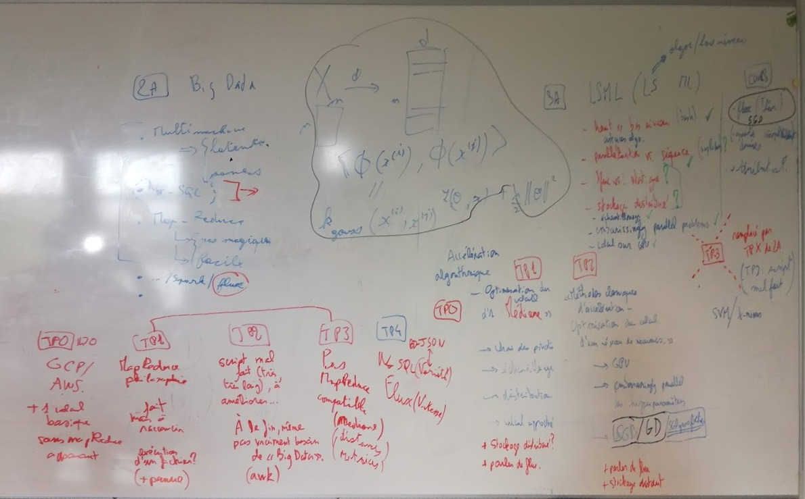

# Enjeux des données massives

## Objectifs

- comprendre les réels enjeux des données massives (_big data_)
- démystifier le "cloud" et le "big data" : beaucoup de problèmes sont juste mal posés et ne nécessitent pas de traitement particulier
- utiliser de la ligne de commande
- utiliser des infrastructures de calcul distantes
- utiliser des infrastructures de calcul distribué
- utiliser des infrastructures de calcul en flux

*à compléter*

## Structure du cours, organisation en séances

### Cours magistral

### TP

1. 
2. lk
3. d
4.

*à préciser*

## Examens

Proposition de @katossky:

- des Kahoots en début de cours et à la rentrée de la pause
- des QCM post TP sur Moodle
- un examen supplémentaire à définir (compte-rendu de TP? examen sur table? mini-projet ex: lecture d'un article?)

## Bibliographie

- Karau, H., Konwinski, A., Wendell, P. and Zaharia, M. (2019). *LEARNING SPARK*: O'REILLY MEDIA.
- Documentation officielle amazon EMR : https://docs.aws.amazon.com/fr_fr/emr/latest/ReleaseGuide/emr-release-components.html
- Doc Rstudio pour EMR : https://spark.rstudio.com/examples/yarn-cluster-emr/#set-up-the-cluster

## Prochaines étapes

- [ ] CM3
    
    **must have**
    
    **nice to have**
    
    **to do next**
    - [ ] re-read Shadi's course and include relevent topics
    
- [ ] 

**After course has ended:**

- [ ] clean up directory
- [ ] update readme

**Before next session of the course**

- [ ] Romaric's read
- [ ] Read books:
    - [ ] Principles of Distributed Databases
    - [ ] Distributed Computing for Big Data Analytics

**Possible improvements**

- [ ] include more statiscal algorithms
