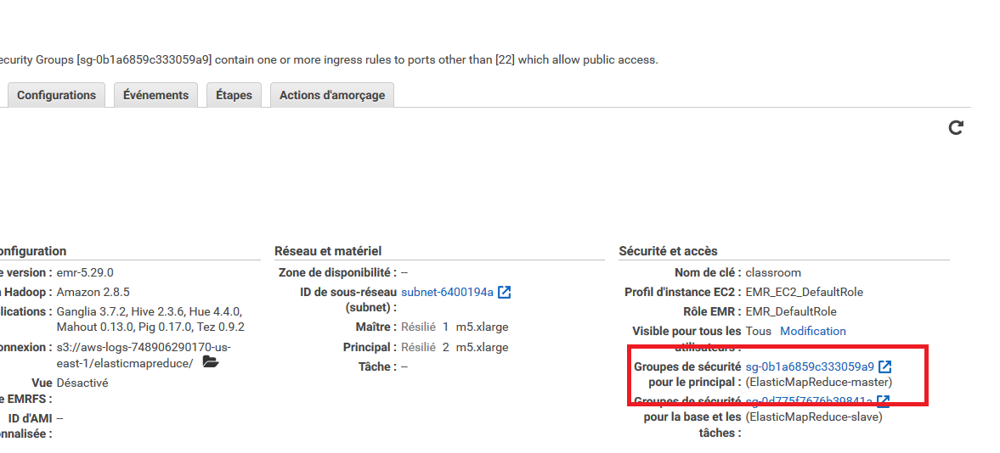
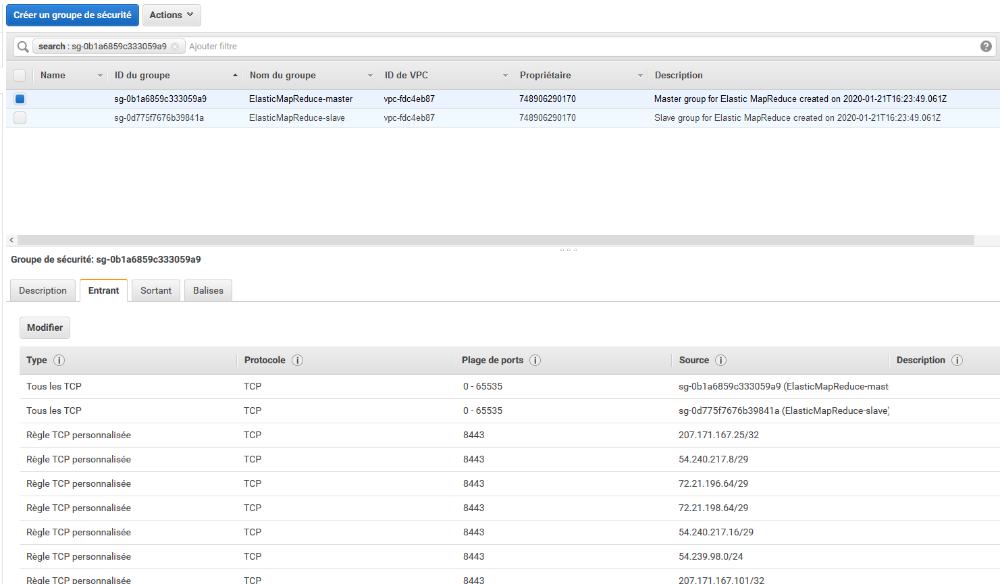
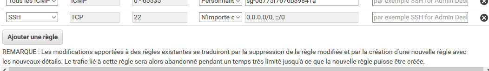

## Création d'un cluster Spark avec EMR

- [ ] Sélectionnez le service EMR 

- [ ] Cliquez sur le bouton "Créer un cluster"
  - [ ] Donnez le nom que vous voulez à votre cluster, par exemple Spark-TPX avec X le numéro du TP
  - [ ] Laissez sélectionnée la journalisation. Cette option permet à votre cluster de stocker les log (journaux) de votre application sur votre espace S3 et ainsi faciliter le débogage. Comme vos log sont stockées sur S3, Amazon va vous facturer le stockage. Le prix de stockage sur S3 est extrêmement faible (0,023$ par Go par mois si vous avez moins de 50To), mais il peut être intéressant d'allez nettoyer vos vieilles log de temps en temps.
  - [ ] Configuration des logiciels
    - [ ] Laissez la version d'emr par défaut
    - [ ] Sélectionnez comme application Spark
  - [ ] Configuration du matériel
    - [ ] Type d'instance : par ex. m5.xlarge (4 cores avec une fréquence max de 3,1 GHz d'un Intel Xeon Platinum série 8000 avec 16Go de Ram). Prix total de 0.272$/h par instance
    - [ ] 3 Instances (ou plus selon vos envies et votre budget)
  - [ ] Sécurité et accès
    - [ ] Sélectionnez une clef SSH que vous avez déjà générée ou allez en générer une autre
    - [ ] Laissez le Rôle EMR et le Profil d'instance par défaut
  - [ ] Démarrer le cluster. Le démarrage peut prendre quelques minutes
  - [ ] Bravo vous avez démarré un cluster Spark en moins de 15min !
- [ ] 
  
- [ ] Avant de continuer, vérifiez si les connexions SSH sont autorisées pour votre cluster. Pour cela allez dans groupe de sécurité pour le principal
    

  - [ ] Ensuite cliquez sur "ElasticMapReduce-master" et sur l'onglet "entrant" pour vérifier si les connexion SSH sont autorisées
  
  
- [ ] Si ce n'est pas le cas cliquez sur "Modifier", allez en bas de la fenêtre qui apparait et ajoutez la règle
    SSH / n'importe où.  Cela vous permettra de vous connecter en SSH à votre cluster depuis n'importe quel ordinateur. Sauvegardez votre changement.

    