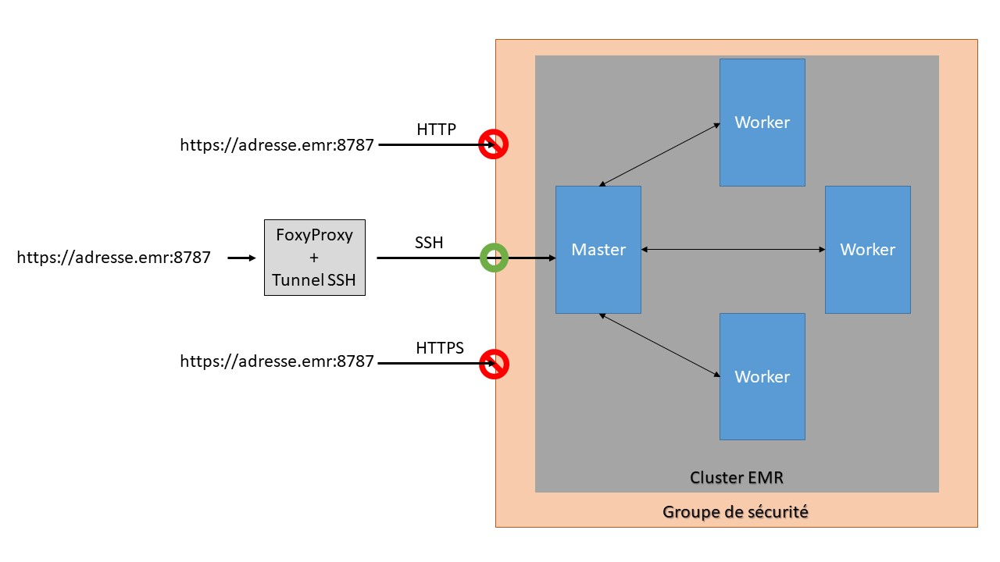
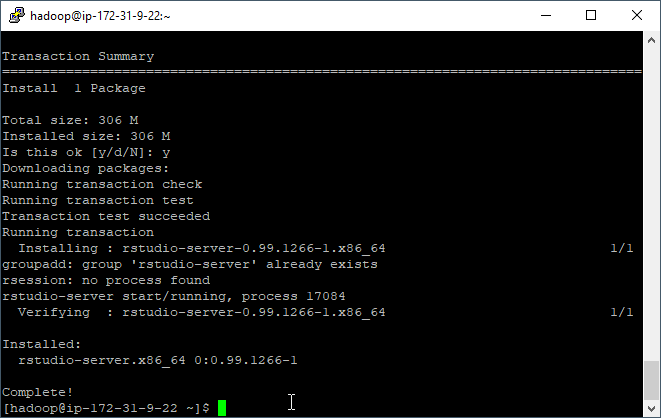

---
output:
  html_document: default
  pdf_document:
     latex_engine: xelatex
---
# TP 0 — Partie 2: Créer et utiliser un cluster Spark avec EMR (Elastic Map Reduce)

## 1. Création d'une clef SSH

**SSH** (**S**ecure **SH**ell) permet de se connecter de façon sécurisée à un système Unix, Linux et Windows. Pour plus d'information, je vous conseille de lire le début de cette [page web ](https://doc.fedora-fr.org/wiki/SSH_:_Authentification_par_cl%C3%A9)

&#x274f; 1-1 : Dans la barre de recherche, cherchez "EC2" et cliquez dessus  
&#x274f; 1-2 : Dans le panneaux de gauche cherchez "Paires de clef" (dans la section "Réseau et sécurité") et cliquez dessus.  
&#x274f; 1-3 : Cliquez sur "Créer une paire de clés"  
&#x274f; 1-4 : Donnez lui un nom (par ex: "spark_cluster_TP"), sélectionnez le format PPK, et cliquez sur "créer"  
&#x274f; 1-5 : Enregistrez le fichier et ne le perdez pas !  

## 2. Conversion au format PPK

&#x274f; 2-1 : Dans la barre de recherche windows cherchez "PuTTygen"  
&#x274f; 2-2 : Cliquez sur Load  
&#x274f; 2-3 : Allez dans le dossier où vous avez sauvegardé votre clef. Elle ne doit pas encore apparaître.  
&#x274f; 2-4 : En bas à droite sélectionnez "All Files (*\.\*)"  
&#x274f; 2-5 : Sélectionnez votre clef  
&#x274f; 2-6 : Un message apparait sur PuTTygen, validez le  
&#x274f; 2-7 : Cliquez sur "Save private key", puis sur "Oui" (on ne va pas mettre de passphrase)  
&#x274f; 2-8 : Sauvegardez votre clef privée .ppk  
&#x274f; 2-9 : Quittez PuTTygen  

Vous avez fini de générer votre clef ssh!

## 3. Création d'un cluster Spark avec EMR

&#x274f; 3-1 Sélectionnez le service EMR 


- [ ] Cliquez sur le bouton "Créer un cluster"
  - [ ] Donnez le nom que vous voulez à votre cluster, par exemple Spark-TPX avec X le numéro du TP
  - [ ] Laissez sélectionnée la journalisation. Cette option permet à votre cluster de stocker les log (journaux) de votre application sur votre espace S3 et ainsi faciliter le débogage. Comme vos log sont stockées sur S3, Amazon va vous facturer le stockage. Le prix de stockage sur S3 est extrêmement faible (0,023$ par Go par mois si vous avez moins de 50To), mais il peut être intéressant d'allez nettoyer vos vieilles log de temps en temps.
  - [ ] Configuration des logiciels
    - [ ] Laissez la version d'emr par défaut
    - [ ] Sélectionnez comme application Spark
  - [ ] Configuration du matériel
    - [ ] Type d'instance : par ex. m5.xlarge (4 cores avec une fréquence max de 3,1 GHz d'un Intel Xeon Platinum série 8000 avec 16Go de Ram). Prix total de 0.272$/h par instance
    - [ ] 3 Instances (ou plus selon vos envies et votre budget)
  - [ ] Sécurité et accès
    - [ ] Sélectionnez une clef SSH que vous avez déjà générée ou allez en générer une autre
    - [ ] Laissez le Rôle EMR et le Profil d'instance par défaut
  - [ ] Démarrer le cluster. Le démarrage peut prendre quelques minutes
  - [ ] Bravo vous avez démarré un cluster Spark en moins de 15min !
- [ ] 
  
- [ ] Avant de continuer, vérifiez si les connexions SSH sont autorisées pour votre cluster. Pour cela allez dans groupe de sécurité pour le principal
    

  - [ ] Ensuite cliquez sur "ElasticMapReduce-master" et sur l'onglet "entrant" pour vérifier si les connexion SSH sont autorisées
  
  
- [ ] Si ce n'est pas le cas cliquez sur "Modifier", allez en bas de la fenêtre qui apparait et ajoutez la règle
    SSH / n'importe où.  Cela vous permettra de vous connecter en SSH à votre cluster depuis n'importe quel ordinateur. Sauvegardez votre changement.

    

  ## 4. Accéder à l'interface de suivi du cluster

  ### Un peu de sécurité

  Pour des raisons de sécurité, les connexions à votre cluster depuis l'extérieur sont limitées aux connexions SSH. Même s'il est possible d'autoriser plus de connexions via les "groupes de sécurité" d'aws, votre cluster ne répondra qu'au requête SSH. Problème, votre navigateur internet ne sait pas faire des requête SSH. Et tel quel il vous ait impossible d'accéder aux interface web de votre cluster. Cela est déjà un inconvénient sérieux, mais surtout cela cela vous empêche de vous connecter avec R à votre cluster.

  Pour remédier à cela nous allons faire deux choses :

  - Créer un tunnel SSH entre votre ordinateur et le cluster. Cela permettra à votre ordinateur de faire passez certaines requête dans la connexion SSH établie entre le cluster et vous. Par exemple quand vous accéderez aux interfaces graphiques du cluster cela se fera via l'intermédiaire du tunnel. Le tunnel prendra toutes les requêtes faites pour l'adresse localhost:8157 pour les transmettre aux cluster.
- Installer FoxyProxy. Cette extension de navigateur permet de faire de la redirection de requête pour utiliser des proxys à la volée. Le fonctionnement est le suivant, vous paramétrez des motifs URL qui doivent être redirigez vers un certain proxy. Quand le motif est repéré, FoxyProxy redirige la requête vers le proxy associé aux motifs. Dans le cas présent, le proxy sera localhost:8157, le point d'entrée de notre tunnel. 
  

Cette procédure n'est en aucun cas un "hack" de notre part pour accéder à des services protégés, mais bien la marche à suivre officielle proposé par amazon. **Il est obligatoire de la respecter pour pouvoir utiliser R avec votre cluster**



### Installer FoxyProxy

Pour google chrome : [lien](https://chrome.google.com/webstore/detail/foxyproxy-standard/gcknhkkoolaabfmlnjonogaaifnjlfnp?hl=fr)

Pour firefox: [lien](https://addons.mozilla.org/fr/firefox/addon/foxyproxy-standard/)

Une fois FoxyProxy installé, ouvrez le plugin et importer le fichier se trouvant dans :  

- https://github.com/katossky/panorama-bigdata/blob/master/settings/foxyproxy-settings.json pour firefox
- https://github.com/katossky/panorama-bigdata/blob/master/settings/foxyproxy-settings.xml pour chrome
### Etablir une connexion SSH avec votre cluster

  *(La marche à suivre est également disponible si vous cliquez sur "activez la connexion web" depuis la pag de voter cluster)*

  - [ ] Lancez PuTTY
  
  - [ ] Dans la liste Category, cliquez sur Session
  
  - [ ] Dans le champ Host Name, tapez **hadoop@[DNS public]** avec [DNS public] le DNS public principal de votre cluster (vous le trouverez dans les informations de votre cluster sur l'interface aws)
  
  - [ ] Dans la liste Category, développez Connection > SSH > Auth
  
  - [ ] Pour le fichier de clés privées utilisé pour l'authentification, cliquez sur Browse et sélectionnez le fichier de clés privées  utilisé pour lancer le cluster.
  
  - [ ] Dans la liste Category, développez Connection > SSH, puis cliquez sur Tunnels.
  
  - [ ] Dans le champ Source port, tapez **8157**
  
  - [ ] Sélectionnez les options Dynamic et Auto.
  
    
  
  - [ ] Laissez le champ Destination vide, puis cliquez sur Add.
  
  - [ ] Cliquez sur Open.
  
  - [ ] Cliquez sur Yes pour ignorer l'alerte de sécurité.
  
    
    
  - [ ] Une fois connectez en ssh à votre cluster vous pouvez lancer spark-shell ou pySpark avec
  
    ````shell
    pyspark #pour lancer pyspark
    spark-shell #pour spark-shell
    ````
  
    *Si vous préférez écrire votre code en python, il est nécessaire de lancer spark-shell avant pour charger toutes les bibliothèques java nécessaires.*
  
    
  
  - [ ] Vous pouvez désormais écrire du code spark en interactif. Par exemple voici un petit script python qui compte le nombre de lignes dans un fichier public stocké sur s3.
  
    ````python
    >> sc
    <pyspark.context.SparkContext object at 0x7fe7e659fa50>
    >>> textfile = sc.textFile("s3://gdelt-open-data/events/2016*")
    >>> textfile.count()
    73385698
    ````
  
    
  
    Voici le même script scala en plus condensé
  
    ````scala
    sc.textFile("s3://gdelt-open-data/events/2016*").count()
    ````
  
- [ ] Une fois connectez en ssh à votre cluster vous pouvez lancer spark-shell ou pySpark avec

  ````shell
  pyspark #pour lancer pyspark
  spark-shell #pour spark-shell
  ````

  *Si vous préférez écrire votre code en python, il est nécessaire de lancer spark-shell avant pour charger toutes les bibliothèques java nécessaires.*

  

- [ ] Vous pouvez désormais écrire du code spark en interactif. Par exemple voici un petit script python qui compte le nombre de lignes dans un fichier public stocké sur s3.

  ````python
  >> sc
  <pyspark.context.SparkContext object at 0x7fe7e659fa50>
  >>> textfile = sc.textFile("s3://gdelt-open-data/events/2016*")
  >>> textfile.count()
  73385698
  ````

  <div style="width:550px"></div>
Voici le même script scala en plus condensé
  
````scala
  sc.textFile("s3://gdelt-open-data/events/2016*").count()
````

  

### Ouvrir les interfaces de suivi 

Une fois la connexion shh établie, et FoxyPproxy configuré, vous pouvez désormais accéder aux interfaces de suivi du cluster.


## 5. Lancer un job avec un script

- [ ] Uploadez sur S3 le script que vous voulez utiliser. Par exemple le fichier [exemple](/exemple/script_exemple.py) suivant.

- [ ] Sur l'interface de votre cluster sélectionnez l'onglet "Etape"

  

- [ ] Ajouter une étape

  - [ ] Type étape : application Spark
  - [ ] Nom de l'application : word_count
  - [ ] Mode de déploiement : cluster
  - [ ] Emplacement de l'application : allez chercher sur s3 le script uploadé plus tôt
  - [ ] "Ajouter"

  

- [ ] Vous allez voir votre script apparaitre dans les étapes de votre cluster. Son exécution peut prendre quelques minutes.

  

- [ ] Pour voir le résultat retournez dans la l'onglet "Récapitulatif" puis cliquez sur "Gestionnaire de ressource"

- [ ] Sur l'interface d'Hadoop sélectionnez votre application, puis en bas de la nouvelle page cliquez sur Logs

  

  

- [ ] En bas de la page de log vous trouverez votre résultat


## 6. Se connecter avec Rstudio et sparklyR

- [ ] Connectez-vous en SSH à votre cluster EMR (vous pouvez réutiliser la connexion avec le tunnel faite plus tôt)

- [ ] Installez  Rstudio server

  ````shell
  sudo yum install libcurl-devel openssl-devel # used for devtools
  wget https://download2.rstudio.org/server/centos6/x86_64/rstudio-server-rhel-1.2.5033-x86_64.rpm
  sudo yum install rstudio-server-rhel-1.2.5033-x86_64.rpm
  ````

  
<div style="width:550px"></div>
- [ ] Créez un user pour Rstudio

  ````shell
  # Make User
  sudo useradd -m rstudio-user
  sudo passwd rstudio-user
  ````

- [ ] Créez un dossier dans HDFS pour votre user

  ````shell
  # Create new directory in hdfs
  hadoop fs -mkdir /user/rstudio-user
  hadoop fs -chmod 777 /user/rstudio-user
  ````

- [ ] Connectez-vous à l'interface web de Rstudio server avec l'adresse suivante https://[master-node-public-DNS]:8787 avec [master-node-public-DNS] le DNS public de votre cluster. Puis connectez vous avec l'utilisation rstudio-user et le mot de passe que vous avez choisi.

- [ ] Vous pouvez commencer à coder. Voici un script exemple : [lien](exemple/script_exemple_R.R)

## Liens utiles

- [Documentation officielle spark EMR](https://docs.aws.amazon.com/fr_fr/emr/latest/ReleaseGuide/emr-spark.html)
- [Getting Started with PySpark on AWS EMR](https://towardsdatascience.com/getting-started-with-pyspark-on-amazon-emr-c85154b6b921)

- [Creating PySpark DataFrame from CSV in AWS S3 in EMR  ](https://gist.github.com/jakechen/6955f2de51212163312b6430555b8e0b)

- [Connection avec Rstudio](https://spark.rstudio.com/examples/yarn-cluster-emr/#set-up-the-cluster)