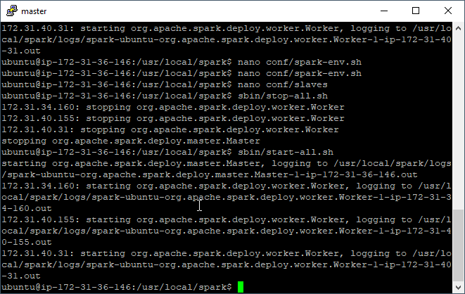

# Créer un cluster Spark sur AWS "à la main"

## Pré-requis

### 1- Générez une clef-ssh

- [ ] 1 : Générez une clef-ssh pour se connecter à vos instances

  - [ ] 1-1 : Connectez-vous à votre compte amazon AWS
  - [ ] 1-2 : Dans la barre de recherche, cherchez "EC2" et cliquez dessus
  - [ ] 1-3 : Dans le panneaux de gauche cherchez "Paires de clef" dans le section "Réseau et sécurité" et cliquez dessus.

  

  - [ ] 1-4 : Cliquez sur "Créer une paire de clés"
  - [ ] 1-5 : Donnez lui le nom "spark_cluster_TP" et cliquez sur "créer"
  - [ ] 1-6 : Enregistrez le fichier et ne le perdez pas !
  - [ ] 1-7 : Dans la barre de recherche windows cherchez "PuTTygen"
  - [ ] 1-8 : Cliquez sur Load
  - [ ] 1-9 : Allez dans le dossier où vous avez sauvegardé votre clef. Elle ne doit pas encore apparaitre.
  - [ ] 1-10 : En bas à droite sélectionnez "All Files (*\.\*)"
  - [ ] 1-11 : Sélectionnez votre clef
  - [ ] 1-12 : Un message apparait sur PuTTygen, validez le
  - [ ] 1-13 : Cliquez sur "Save private key", puis sur "Oui" (on ne va pas mettre de passphrase)
  - [ ] 1-14 : Sauvegarder votre clef privée .ppk
  - [ ] 1-15 : Quittez PuTTygen
  - [ ] 1-16 : Vous avez fini de générer votre clef ssh.

### 2-Créez des machines virtuelles

- [ ] 2 : Créer l'instances EC2 qui serviront pour notre cluster.

  - [ ] 2-1 : Retournez sur votre navigateur web, et cliquez dans le volet à gauche sur "Instances" dans la section "Instances". Vous arriverez une un écran similaire, mais vous n'aurez pas d'instances déjà existantes normalement

  

  - [ ] 2-2 : Cliquez sur "Lancer une instance"

  - [ ] 2-3 : Voici les choix à faire

    - [ ] 2-3-1 : AMI :  Ubuntu Server 18.04 LTS (HVM), SSD Volume Type

    - [ ] 2-3-2 : Type d'instance : m5a.large

    - [ ] 2-3-3 : "Vérifier et lancer"

    - [ ] 2-3-4 : "Lancer"

    - [ ] 2-3-5 :  Sélectionnez la clef "spark_cluster_TP" et cochez la case

    - [ ] 2-3-6 : "Lancez des instances"

    - [ ] 2-3-7 : "Affichez les instances"

    - [ ] 2-3-8 : Cliquez sur le "name" de votre machine qui doit être vide et appelez le master.

      Bravo vous venez de lancer votre première machine virtuelle sur amazon AWS.

  - [ ] 2-4 : Notez dans un fichier les informations suivantes :

    Master :
  
  - IP public XXXX
    - IP privé YYYY

    Vous trouverez ses informations dans la fenêtre du bas une fois votre instance sélectionnée 

  

  

  - [ ] 2-5 : Créez un modèle de lancement à partir de votre instance. Cela permettra de créer plus facilement des pour notre cluster
  
    - [ ] 2-5-1 : Sélectionnez votre instance
    - [ ] 2-5-2 : "Actions"
    - [ ] 2-5-3 : "Create Template From Instance"
    - [ ] 2-5-4 : Appelez votre template : "node_cluster_spark"
    - [ ] 2-5-5 : Pour la description : "Une instance pour notre cluster spark"
  - [ ] 2-5-6 : Descendez en bas de la page et "Créer un modèle de lancement"
    - [ ] 2-5-7 : En haut de la page cliquez sur "EC2"

  - [ ] 2-6 : Cliquez sur "Instances"

  - [ ] 2-7 : Lancer une machine worker
  
    - [ ] 2-7-1 :  Flèche vers le bas de "Lancer une instance", "Lancement d'un instance à partir d'un modèle"
    - [ ] 2-7-2 : Sélectionner votre modèle
    - [ ] 2-7-3 : Pour commencer on ne va créer qu'une nouvelle instance
  - [ ] 2-7-4 : Descendez en base de la page
    - [ ] 2-7-5 : "Lancer une instance à partir d'un modèle"

  - [ ] 2-8 : Retournez sur l'écran avec vos instances et sélectionnez votre nouvelle instance

  - [ ] 2-9 : Appelez votre instance "worker1"

  - [ ] 2-10 : Dans votre fichier ajoutez
  
  worker 1 : 
  
    - IP public XXXX
    - IP privé YYYY
  
  - [ ] 2-11 : Vous venez de créer vos deux premières instances EC2 qui vont servir de base à notre cluster.

### 3-Modifiez le groupe de sécurité de vos instances

Pour des raisons de sécurité amazon verrouille fortement les connexions à vos machine. Actuellement seules les connections en ssh sont possibles. Nous allons rendre possible les connexions de tous les types à vos machines virtuelle EC2 depuis l'Ensai, ainsi que rendre possible les connexions entre vos instances.

- [ ] 3-Modifiez le groupe de sécurité de vos instances

  - [ ] 3-1 : Dans l'onglet de gauche cliquez sur "Groupes de sécurité" dans l'onglet "Réseau et sécurité"

    

    Normalement vous ne devez avoir qu'un seul groupe de sécurité appelé "launch-wizard-1"

  - [ ] 3-2 : Cliquez sur votre groupe de sécurité, dans l'onglet du bas cliquez sur entrant puis "Modifier"

  - [ ] 3-3 : Ajoutez les règles suivantes :

    - Tout le trafic / Tous / Source "Mon IP" / proxy de l'Ensai
    - Tout le trafic / Tous / XX.XX..0.0/16 / cluster spark. (avec XX.XX les deux premiers éléments de l'IP privée de votre master)

    

  - [ ] 3-4 Enregistrez et retournez sur l'écran de vos instances EC2


### 4- Se connecter aux machines virtuelles

- [ ] 4 : Se connecter aux machines virtuelles

  - [ ] 4-1 : Ouvrez Putty 

  - [ ] 4-2 : Dans Host Name mettez : ubuntu@XXXX avec XXXX l'adresse IP publique du serveur

  - [ ] 4-3 : Connexion ssh, port 22

  - [ ] 4-4 : Menu de gauche : Connection / SSH / Auth

  - [ ] 4-5 : Allez chercher votre clef privée .ppk

    

  - [ ] 4-6 : Menu de gauche : "Behaviour"

  - [ ] 4-7 : Window title : master

  - [ ] 4-8 : Menu "Session"

  - [ ] 4-9 : Sauvegardez votre session avec le nom "spark-master"
  
  - [ ] 4-10 : Une fenêtre apparait, cliquez sur oui
  
  - [ ] 4-11 : Vous voilà connecté à votre master node, pour vous connecter à votre worker ouvrez une autre fenêtre PuTTy, faites les mêmes étapes en utilisant l'IP du worker et en appelant la fenêtre worker

## 4 - Installez Java et Scala sur vos instances EC2

- [ ] 5 : Installez Java et Scala sur vos instances EC2

  L'installation de java et scala doit se faire sur chacune des machines !

  - [ ] 5-1 Ouvrez la fenêtre ssh qui vous connecte à votre master

  - [ ] 5-2 Installez java :

    - [ ] 5-2-1 : Installez java via le gestionnaire de package

    ```shell
    sudo apt update
    sudo apt install openjdk-11-jre-headless
    ```
  
    - [ ] 5-2-2 : Quand on vous le demande appuyez sur Y puis Enter

    - [ ] 5-2-3 : Vérifiez la version de java

      ```shell
      java --version
      ```
  
      

  - [ ] 5-3 Installez scala :

    - [ ] 5-3-1 : Installez scala avec le gestionnaire de package

      ```shell
      sudo apt install scala
      ```

    - [ ] 5-3-2 : Quand on vous le demande appuyez sur Y puis Enter
  
    - [ ] 5-3-3 :  Vérifiez l'installation de scala

      ```shell
      scala -version
      ```

      
  
  - [ ]  Voici un script synthétique 

    ```shell
    sudo apt update
    sudo apt install openjdk-11-jre-headless
    Y
    sudo apt install scala
    Y
    ```
  
  - [ ] 5-4 : Recommencez ces étapes pour votre worker !

### 5 - Configurer la connexion SSH entre vos machines

Nous allons maintenant configurer les connexion SSH entre vos machines pour que la machine master puisse contrôler les machine workers.

- [ ] 6-1 : Sur le master :

  - [ ] 6-1-1 : Installez openssh-server et openssh-client

    ```shell
    sudo apt install openssh-server openssh-client
    ```

  - [ ] 6-1-2 : Créez un couple de clefs RSA

    ```shell
    ssh-keygen -t rsa -P ""
    ```

    Appuyer sur entrer, votre clef est enregistrée dans ~/.ssh/id_rsa.pub

  - [ ] 6-1-3  : Copiez la clef dans votre presse papier

    ````shell
    cat ~/.ssh/id_rsa.pub
    ````

    

- [ ] 6-2 : Sur les workers

  - [ ] 6-2-1 Ajoutez la clef aux clefs autorisées

    ```shell
    cat >> ~/.ssh/authorized_keys
    [paste your clipboard contents]
    [ctrl+d to exit]
    ```

    Si vous avez copiez les commandes au dessus, vous allez devoir de nouveau allez chercher votre clef !

- [ ] 6-3 : Testez votre connexion sur le master

  ```
  ssh -i ~/.ssh/id_rsa ubuntu@DNS privé worker
  ```

  Tapez yes. Vous devez arrivez sur un terminal de ce genre

  

  Tapez 

  ````
  exit
  ````

  pour mettre fin à la connection ssh

- [ ] 6 -4 : Vous venez de configurer les connections ssh entre vos machines

## Installer Spark (enfin) 

- [ ] 7 : Installez Spark sur chacune de vos machines

  - [ ] 7-1 : Télécharger Spark

    ```shell
    wget http://apache.crihan.fr/dist/spark/spark-2.4.4/spark-2.4.4-bin-hadoop2.7.tgz
    ```

  - [ ] 7-2 : Extrayez l'archive, la déplacer dans /usr/local/spark et ajouter spark/bin  dans la variable PATH

    ```
    tar xvf spark-2.4.4-bin-hadoop2.7.tgz
    sudo mv spark-2.4.4-bin-hadoop2.7/ /usr/local/spark
    export PATH=/usr/local/spark/bin:$PATH
    ```

- [ ] 8 : Configurez le master pour qu'il garde trace des workers

  - [ ] 8-1 : Placez vous dans le répertoire de spark
    
    
    ```
    cd /
    cd /usr/local/spark/
    ```
    
  - [ ] 8-2 : Configurez le master
  
    ````
      nano conf/spark-env.sh
    ````
  
    Cela va ouvrir nano, un éditeur de texte en ligne de commande. Saisissez le texte suivant, avec XXXXXX l'adresse IP privé du serveur master.
  
    ````
    export SPARK_MASTER_HOST=XXXXXX
    export JAVA_HOME=/usr/lib/jvm/java-11-openjdk-amd64/
    ````
  
    Sauvegardez et quittez nano en faisant ctrl+X, puis Y, puis entrer.
  
    - [ ] 8-3 : Spécifiez les IP des workers
  
      ````
        nano conf/slaves
      ````
  
      Puis saisissez l'IP privé du serveur worker. Si vous voulez avoir plusieurs worker il suffit d'écrire les différentes IP sur différentes lignes. Par exemple :
  
      

## Tester votre cluster

- [ ] 9 : Lancez votre cluster

  - [ ] 9-1 : Sur la fenêtre PuTY de votre master tapez

    ````
    ./sbin/start-all.sh
    ````

    

  - [ ] 9-2 : Connectez-vous à l'interface graphique de Spark via l'adresse http://XXXX:8080 avec XXXX l'IP publique de votre master.

    

    (Voici un exemple d'IHM de spark avec 3 workers)

  - [ ] 9-3 : Connectez-vous à votre cluster avec pyspark ou spark-shell

    ````
    pyspark --master spark://XXXX:7077
    ````

    avec XXXX l'IP public de votre serveur master.

    

    

- [ ] Bravo ! Vous venez de créer un cluster spark !

## Ajouter rapidement des workers

Maintenant que vous avez configuré un master et un worker il est possible de facilement rajouter des worker. Pour cela on va cloner un worker existant. 

- [ ] Sur l'écran de vos instances EC2 sélectionnez votre worker

- [ ] Puis cliquez sur Action/Image/Créer l'image

  

- [ ] Pour le nom d'image : "spark-worker", pour la description : "L'image d'un worker spark"

- [ ] Créez l'image. La création prend quelques minutes

- [ ] Pour créer un nouveau worker

  - [ ] Menu déroulant de "Lancer une instance"
  - [ ] "Lancement d'une instance à partir d'un modèle"
  - [ ] Sélectionnez votre modèle précédemment créé.
  - [ ] Dans les détails de l'instance  choisissez l'AMI que vous avez crée grâce à la barre de recherche."Mes AMI"
  - [ ] En bas de la page"Lancer une instance à partir d'un modèle"

- [ ] Vous devez maintenant ajouter l'adresse IP privée de la nouvelle machine dans le fichier slaves du master.

- [ ] Relancez votre cluster avec 

  ````
  ./sbin/stop-all.sh
  ./sbin/start-all.sh
  ````

  

## Une fois le TP terminé

- [ ] Pensez à éteindre toutes vos machines : Action / Etat de l'instance / Arrêtez

- [ ] À partir de maintenant si vous voulez relancer votre cluster

  - [ ] Allumez toutes vos machines

  - [ ] Connectez vous au master en ssh. Attention l'IP publique à changé

  - [ ] Exécutez le script start-all.sh

    ```` 
    /usr/locale/spark/sbin/start-all.sh
    ````

    