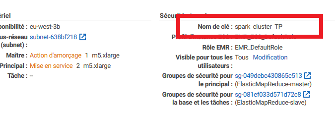

# Installer Rstudio-server sur votre cluster et vous y connecter avec le terminal

### Installer FoxyProxy

:arrow_forward: Pour google chrome : [lien](https://chrome.google.com/webstore/detail/foxyproxy-standard/gcknhkkoolaabfmlnjonogaaifnjlfnp?hl=fr)

:arrow_forward: ​Pour firefox: [lien](https://addons.mozilla.org/fr/firefox/addon/foxyproxy-standard/)

Une fois FoxyProxy installé, ouvrez le plugin et importer le fichier se trouvant dans :  

- https://github.com/katossky/panorama-bigdata/blob/master/settings/foxyproxy-settings.json pour firefox
- https://github.com/katossky/panorama-bigdata/blob/master/settings/foxyproxy-settings.xml pour chrome

### Etablir une connexion SSH avec votre cluster

:arrow_forward: La marche à suivre est également disponible si vous cliquez sur "SSH" depuis la pag de voter cluster

:arrow_forward: Vous pouvez vous connecter même si votre cluster est en "Démarrage en cours"

  - [ ] Ouvrez un terminal

  - [ ] Exécutez la commande suivante

    ````bash
    ssh hadoop@[DNS public]  -i ~/mykeypair.pem
    ````

    Avec

    - [DNS public] : le DNS public principal de votre cluster (vous le trouverez dans les informations de votre cluster sur l'interface aws). Vous pouvez noter le  **[DNS public]** dans un bloc note pour le retrouver plus facilement.

    

    - ~/mykeypair.pem : le chemin vers la clef de votre cluster
      

  - [ ] Cliquez sur Yes pour ignorer l'alerte de sécurité.

## Installer Rstudio server et postgresql-devel

````shell
  sudo yum install libcurl-devel openssl-devel # used for devtools
````


````bash
  wget https://download2.rstudio.org/server/centos6/x86_64/rstudio-server-rhel-1.2.5033-x86_64.rpm
  sudo yum install rstudio-server-rhel-1.2.5033-x86_64.rpm
````

:warning: Faites bien attention, il est possible qu'en copiant/collant les lignes, un saut à la ligne se mette sur la première instruction, ce qui conduira à une erreur d'installation


- [ ] Créez un user pour Rstudio

  ````shell
  # Make User
  sudo useradd -m rstudio-user
  sudo passwd rstudio-user
  ````

  :warning: Retenez votre mot de passe

- [ ] Créez un dossier dans HDFS pour votre user

  ````shell
  # Create new directory in hdfs
  hadoop fs -mkdir /user/rstudio-user
  hadoop fs -chmod 777 /user/rstudio-user
  ````

- [ ] Installez postgresql-devel

  ````bash
  sudo yum install postgresql-devel
  ````

  

## Etablir un tunnel SSH avec votre cluster

:exclamation: La session SSH que vous allez ouvrir devra rester ouvertes tant que vous utiliser Rstudio-server

  - [ ] 

- [ ] Ouvrez un terminal
  
  - [ ] Exécutez la commande suivante

    ````bash
    ssh -i ~/mykeypair.pem -N -D 8157 hadoop@ec2-**[DNS public]**
    ````

    Avec

    - [DNS public] : le DNS public principal de votre cluster (vous le trouverez dans les informations de votre cluster sur l'interface aws). 

    - ~/mykeypair.pem : le chemin vers la clef de votre cluster

    Normalement il ne va rien se passer, et vous pouvez croire que rien ne fonctionne. Mais il n'en est rien ! Si aucune erreur ne s'est affichée c'est que tout fonctionne

## Se connecter à Rstudio-server

Connectez-vous à l'interface web de Rstudio server avec l'adresse suivante https://**[DNS public]** :8787 avec **[DNS public]** le DNS public de votre cluster. Puis connectez vous avec l'utilisation rstudio-user et le mot de passe que vous avez choisi.

## Se connecter au cluster spark via Rstudio-server

Voici un code minimal pour vous connecter au cluster spark avec Rstudio-server

````R
install.packages("sparklyr")
library(sparklyr)
Sys.setenv(SPARK_HOME="/usr/lib/spark")
sc <- spark_connect(master="yarn-client")
````

.png)

.png)

:heavy_exclamation_mark::heavy_exclamation_mark::heavy_exclamation_mark::heavy_exclamation_mark: Pensez à sauvegarder votre script sur votre poste de temps en temps via des copier coller. Surtout avant d'éteindre votre cluster ! 
:heavy_exclamation_mark::heavy_exclamation_mark::heavy_exclamation_mark::heavy_exclamation_mark::heavy_exclamation_mark::heavy_exclamation_mark::heavy_exclamation_mark::heavy_exclamation_mark::heavy_exclamation_mark::heavy_exclamation_mark::heavy_exclamation_mark::heavy_exclamation_mark: **PENSEZ À ÉTEINDRE VOTRE CLUSTER À LA FIN**