---
output:
  pdf_document:
     latex_engine: xelatex
  html_document: default
---
# TP 0 — Partie 1: Découverte de l'interface d'Amazon Web Service (AWS)

## Objectifs

Ce TP a pour but de vous familiariser avec l'interface d'Amazon Web Service (AWS). Pendant ce TP vous allez :

- Créer une com  pte AWS educate
<!--- Créer une clef SSH qui assurera la sécurité de vos connexions en ligne de commande à vos machine virtuelle-->
- Copier des données dans votre espace de stockage Amazon Simple Storage Service (S3)
- Lancer une machine virtuelle (VM) et s'y connecter (**pas aujourd'hui**)
<!--- Créer un cluster Spark avec Amazon Elastic Map Reduce (EMR)-->
<!--- Vous connecter à votre cluster et exécuter des commandes basiques-->
- Eteindre votre VM

Le cluster que vous allez créer pendant le TP pourra être cloné lors de vos prochains TP.

## 1. Création du compte AWS Educate

Suivez les instructions à partir du mail AWS Educate reçu sur votre adresse ENSAI. Créez vous bien un "starter account". Cela vous permettra d'utiliser la plateforme AWS, mais sans jamais utiliser votre carte de crédit, et donc sans risque de devoir payer quoi que ce soit. Dans le processus de création, vous allez recevoir deux mails. Un premier pour vous demander de confirmer votre mail, un un second (qui arrivera quelques minutes plus tard) qui vous permettra de finaliser la création de votre compte. 

Une fois voter compte créé, connectez vous à la plateforme AWS Educate, et cliquez sur "Classroom & Credit" (*note : toutes les images proviennent d'un compte avec l"accès "Educator", il est possible que les interfaces ou que la marche à suivre soient un peu différentes.*)

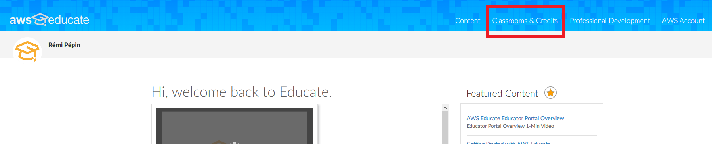

Sur la page suivante cliquez sur "Go to classroom"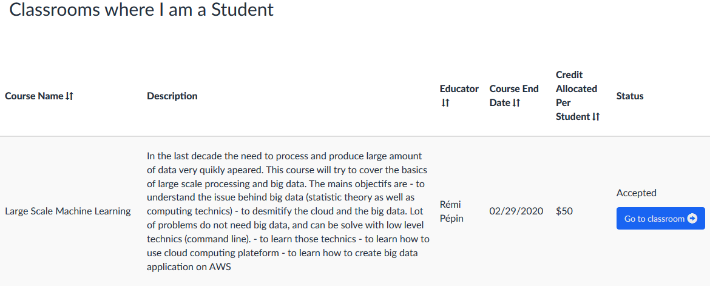

Une fenêtre va s'ouvrir, cliquez sur "Continue"

.png)

Vous serez ainsi redirigé vers "Vocareum", l'application tierce qui gère les "classrooms". Sélectionnez le bon cours. 

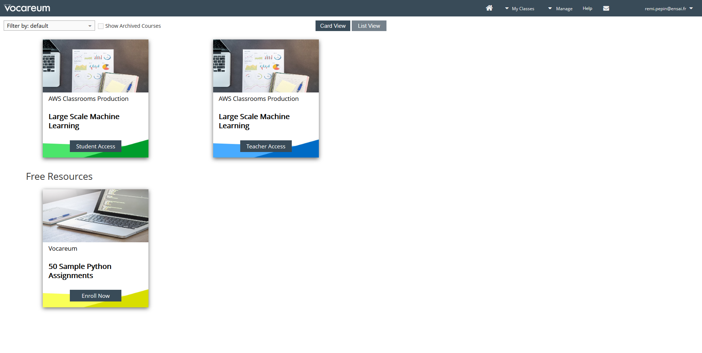

Enfin sur la dernière fenêtre, cliquer sur "AWS console". Cela vous redirigera vers la plateforme AWS. Il vous est rappelé d'utiliser le compte AWS qui vous est fourni de manière responsable. C'est à dire de penser à éteindre toutes les instances que vous créez une fois qu'elles ne sont plus utilisées.

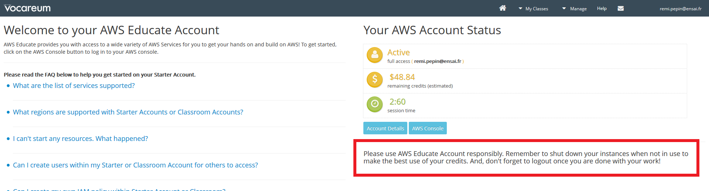

Le compte AWS que vous allez utiliser pour les TP est localiser en Virginie du Nord. Ne changez pas cela ! Comme votre compte est à but purement scolaire, vous ne disposez pas de l'intégralité des services de la plateforme (vous n'avez pas accès aux information de facturation par exemple). De même votre compte est un compte généré par Vocareum, et vous ne pouvez pas y accéder sans passez par ce service. Il est donc inutile de le noter. Pour des connections futures à AWS dans le cadre scolaire, passez toujours par le portail AWS Educate, puis Vocareum.

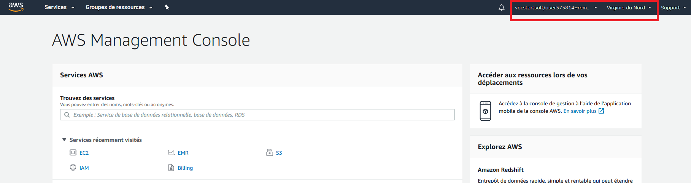

## 2. Exploration

Dans l'onglet "Services", trouvez:

&#x274f; EC2, le service de calcul  
&#x274f; S3, le service de calcul  
&#x274f; la section dédiée aux bases de données  
&#x274f; la section dédiée au _machine-learning_  
&#x274f; la section dédiée à l'analyse de données  
&#x274f; la section dédiée à la gestion des coûts  

Vérifiez que votre crédit de 50$ est bien activé.

## 3 Créeation d'un espace de stockage Amazon Simple Storage Service (S3)

**Amazon Simple Storage Service** (S3) est la solution de base que propose AWS pour stocker vos données de manière pérenne. Amazon dit assurer une durabilité de vos données de 99,999999999 %. Cela signifie que si vous stockez 10 000 000 objets avec Amazon S3, vous  pouvez vous attendre à perdre en moyenne un objet unique une fois tous les 10 000 ans.

Ce stockage est assuré à coût relativement élevé (de l'ordre de ~0,02 \$/Go/mois), sachant que vous payez en sus les opérations de lecture (de l'ordre de ~0,09 \$/Go ; les écritures sont gratuites). 1 To de données vous coûte ainsi 240€ à l'année. Pour comparaison, un disque dur externe d'1 To coûte actuellement ~40€, et un cloud-storage pour particulier coûte ~10€ / mois pour 2 To. S3 est ainsi destiné à des données d'usage régulier. D'autres offres de stockage existent comme les archives, pour des données utilisées moins régulièrement, ou les bases de données._

Tous les services que vous propose AWS peuvent nativement lire depuis et écrire vers S3. Ainsi, les programmes que vous exécutez, les données que vous traîtez... peuvent être importés dans S3. Chaque élément hébergé dans S3, appelé "objet", est acessible par une URL unique. Vous pouvez restreindre ou au contraire étendre les droits d'accès à vos objets.

&#x274f; 3-1 : Dans la barre de recherche, cherchez "S3" et cliquez dessus

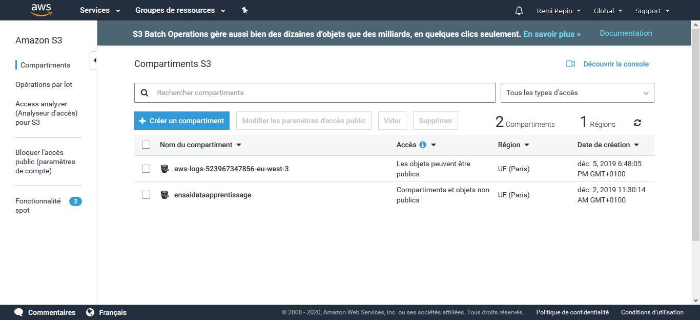

&#x274f; 3-2 Cliquez sur "Créer un compartiment" (en anglais un "bucket")  
&#x274f; 3-3 Choisissez un nom unique à votre compartiment  
&#x274f; 3-4 Laissez toutes les valeurs par défaut et créez votre compartiment  

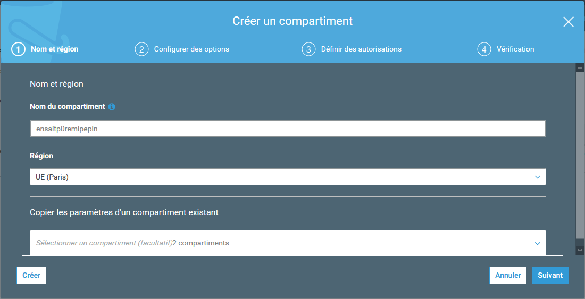

## 4. Copie des données dans votre espace de stockage

&#x274f; 4-1 À partir du bouton "Charger", ajoutez un fichier (par exemple un fichier CSV) à votre compartiment. Laissez toutes les valeurs par défaut.

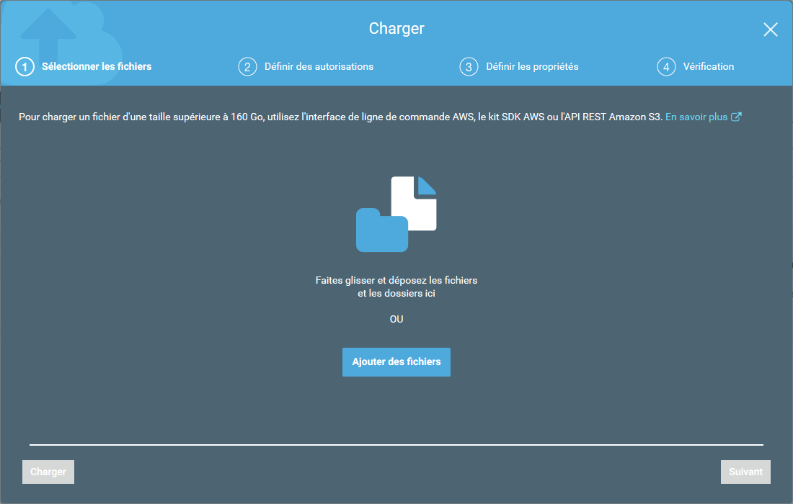

- Un des écrans permet de gérer les permissions liées à votre fichier: qui y a accès, avec quels droits, et si vous voulez rendre votre fichier public. Par défaut, votre fichier est privé.
  
    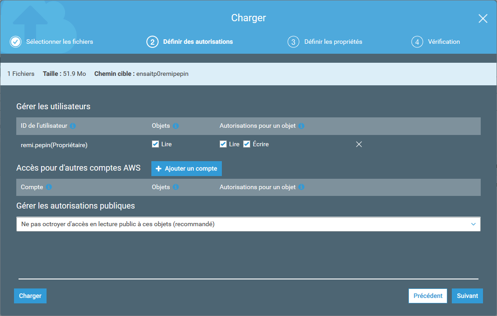
  
- Un des écrans vous permet de choisir la classe de stockage. S3 en dispose de quelques une, chacune avec des cas d'utilisation différent. Par exemple le stockage "glacier" (EN: "glacieer") permet d'archiver des données pour un coût faible, mais vos données auront un délais d'accès et une facturation supplémentaire par accès.

    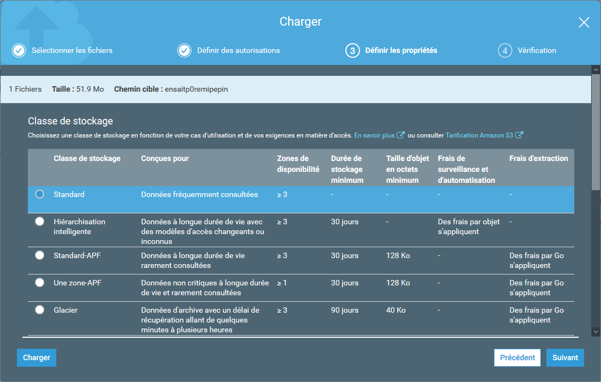
 
&#x274f; 4-2 Une fois le chargement terminé cliquez sur votre fichier

- Dans `Présentation > URL d'objet`, vous voyez l'URL de votre fichier, pour pouvoir s'y référencer par la suite, par exemple pour y donner accès sur Internet. (Depuis les services Amazon, l'adresse est raccourcie en `s3://<bucket-name>/<path-to-file>`.)
- "Chemin de copie" est une mauvaise traduction de "Copy Path". Il faut s'y habituer, seule une toute petite partie d'AWS est traduite, et plutôt mal.
- Dans l'onglet "Sélectionner depuis" vous avez accès à des outils d'exploration de vos données. Remarquez que sur AWS tous les traîtements coûtent! À tout moment, vous pouvez aller dans l'onglet facturation pour vérifier vos dépenses.
  
    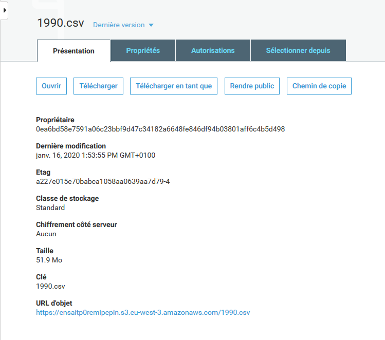

<!--
 
## 5. Création d'une clef SSH

**SSH** (**S**ecure **SH**ell) permet de se connecter de façon sécurisée à un système Unix, Linux et Windows. Pour plus d'information, je vous conseille de lire le début de cette [page web ](https://doc.fedora-fr.org/wiki/SSH_:_Authentification_par_cl%C3%A9)

&#x274f; 5-1 : Dans la barre de recherche, cherchez "EC2" et cliquez dessus  
&#x274f; 5-2 : Dans le panneaux de gauche cherchez "Paires de clef" (dans la section "Réseau et sécurité") et cliquez dessus.  
&#x274f; 5-3 : Cliquez sur "Créer une paire de clés"  
&#x274f; 5-4 : Donnez lui un nom (par ex: "spark_cluster_TP"), sélectionnez le format PPK, et cliquez sur "créer"  
&#x274f; 5-5 : Enregistrez le fichier et ne le perdez pas !  
<!-- ce qui suit ne me semble pas nécessaire
&#x274f; 5-6 : Dans la barre de recherche windows cherchez "PuTTygen"  
&#x274f; 5-7 : Cliquez sur Load  
&#x274f; 5-8 : Allez dans le dossier où vous avez sauvegardé votre clef. Elle ne doit pas encore apparaître.  
&#x274f; 5-9 : En bas à droite sélectionnez "All Files (*\.\*)"  
&#x274f; 5-10 : Sélectionnez votre clef  
&#x274f; 5-11 : Un message apparait sur PuTTygen, validez le  
&#x274f; 5-12 : Cliquez sur "Save private key", puis sur "Oui" (on ne va pas mettre de passphrase)  
&#x274f; 5-13 : Sauvegardez votre clef privée .ppk  
&#x274f; 5-14 : Quittez PuTTygen  
<!-- jusqu'ici

Vous avez fini de générer votre clef ssh!

-->

## 5. Créer une machine virtuelle (**_pas aujourd'hui_**)

&#x274f; 5-1 : Naviguez vers EC2  
&#x274f; 5-2 : Cliques sur Lancer une instance  
&#x274f; 5-3 : Vous devez choisir l'image de la machine à créer. Une image contient notamment le système d'exploitation. Choisissez la première: Amazon Linux 2 AMI. (Vous remarquez que certaines sont "elligibles à l'offre gratuite" pour les nouveaux utilisateurs AWS.)  
&#x274f; 5-4 : Vous choisissez ensuite la configuration de VM. Par exemple, vous pouvez choisir une machine d'usage général à 2 coeurs `t2.micro`, alle aussi elligible à l'offre gratuite.  
&#x274f; 5-5 : D'autres options sont disponibles (configuration, stockage, sécurité...), mais nous pouvons d'ores et déjà cliquer sur "Vérifier et lancer".  
&#x274f; 5-6 : Véririfiez les informations puis validez.  
&#x274f; 5-7 : Générez une paire de clés SSH et stockez votre clé privée.  
&#x274f; 5-8 : Et voilà! Votre VM est en cours de lancerment... revenez dans quelques minutes!  

<!-- il semble possible de générer une clé SSH à la volée -->

<!--

&#x274f; Cliquez sur "EC2" dans l'onglet services
&#x274f; Comme précédemment, créez une paire de clés //// ici par contre, le format ppk n'est pas disponible, mais en fait on s'en fout un peu ////
&#x274f; Sur la page d'accueil, cliquez sur "Lancer une instance"
&#x274f; Sélectionnez l'image-machine "Linux 2"

Amazon vous propose un grand nombre de machines virtuelles pré-configurées, avec des configurations physiques variables.

&#x274f; Choisissez une image machine à 4 coeurs ou plus, parmis les configurations prévues pour un usage général, cliquez sur "Vérifie et lancer"
&#x274f; Choisissez la paire de clé précédemment créer
Lisez les avertissements, puis passez outre

Votre machine virtuelle (ou "instance"), est en cours de déploiement.

&#x274f; Avec Putty ... XXXXXXXXXXXXX

Vous êtes connecté à votre machine! Elle n'a pas d'écran ni d'interface web et ne comprend que les lignes de commande.

&#x274f; Pour installaer R, par exemple, lancez la commande: `sudo amazon-linux-extras install R3.4`.

Et voilà! Vous pouvez maintenant effectuer des calculs R sur votre instance.

&#x274f; Prenez le programme R XXXXXXXXXX et exécutez-le sur le fichier XXXXXXXXXXXX avec la commande `R XXXXXXXX`.

-->

## 6. Se connecter à sa VM (**_pas aujourd'hui_**)

## 7. Eteindre la VM

<!-- éteindre l'ensemble des instances lancées -->

Le coût d'une VM est fonction de son temps d'utilisation, pas du travail qu'il accomplit. Ainsi, une fois le travail effectué, vous _devez_ éteindre vos VMs ! **Même si le coût horaire est bas, faire tourner une machine EC2 pendant 1 semaine se chiffre en dizaines d'euros!**

Pour éteindre votre VM, allez sur la page d'accueil EC2 > Instances en cours d'exécution ou sur la bar de navigation Instances > Instances. Selon le type d'instance, vous pouvez l'arrêter (**EN:** _stop_, pour la réutiliser plus tard), ou la résilier (**EN:** _terminate_, i.e. la supprimer). Dans les deux cas, les données en mémoire et le stockage local sont perdus, mais dans le premier cas, la configuration (URL et IP) sont conservés.

Vous avez le choix entre ... et .... . et cliquez sur "Résilier". Cela va éteindre _définitivement_ votre cluster. Vous ne pourrez plus le relancer, à la différence d'une instance Amazon Elastic Compute Cloud (EC2). Mais vous allez pouvoir relancer un cluster en clonant un ancien. Et ainsi ne pas avoir à refaire toutes la configuration. Par contre vous devrez changer l'IP utilisée pour vous y connecter.