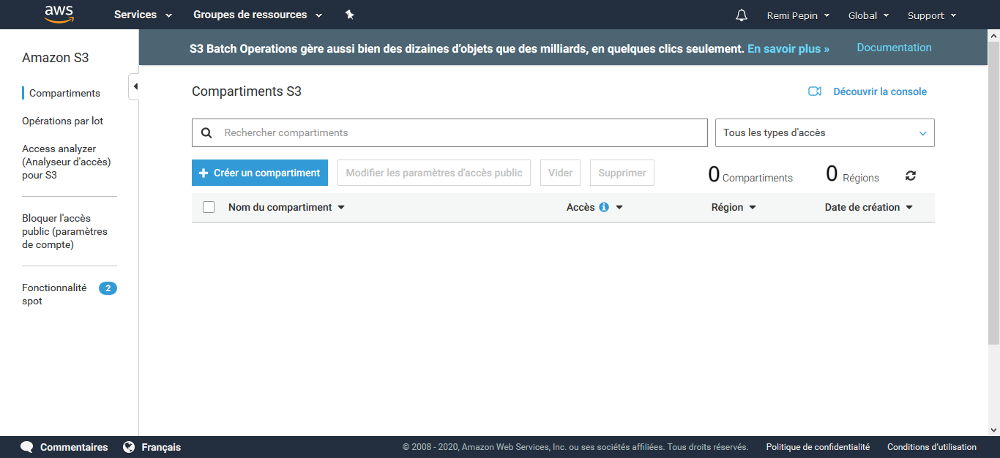

# TP 0 : Découverte de l'interface d'Amazon Web Service (AWS)

## Objectifs

Ce TP à pour but de vous familiariser avec l'interface d'Amazon Web Service (AWS). Pendant ce TP vous allez :

- Vous créer une compte AWS educate

- Créer une clef SSH qui assurera la sécurité de vos connexions en ligne de commande à vos machine virtuelle

- Copier des données dans votre espace de stockage Amazon Simple Storage Service (S3)

- Créer un cluster Spark avec Amazon Elastic Map Reduce (EMR)
- Vous connecter à votre cluster et exécuter des commandes basiques
- Eteindre votre cluster

Le cluster que vous allez créer pendant le TP sera cloner dans le prochain TP.

## Créer son compte AWS educate

## Créer une clef SSH

**SSH** (**S**ecure **SH**ell) permet de se  connecter de façon sécurisée à un système Unix, Linux et Windows. Pour plus d'information, je vous conseille de lire le début de cette [page web ](https://doc.fedora-fr.org/wiki/SSH_:_Authentification_par_cl%C3%A9)

- [ ] 1 : Générez une clef-ssh pour se connecter à vos instances

  - [ ] 1-1 : Connectez-vous à votre compte amazon AWS
  - [ ] 1-2 : Dans la barre de recherche, cherchez "EC2" et cliquez dessus
  - [ ] 1-3 : Dans le panneaux de gauche cherchez "Paires de clef" dans le section "Réseau et sécurité" et cliquez dessus.

  

  - [ ] 1-4 : Cliquez sur "Créer une paire de clés"
  - [ ] 1-5 : Donnez lui le nom "spark_cluster_TP" et cliquez sur "créer"
  - [ ] 1-6 : Enregistrez le fichier et ne le perdez pas !
  - [ ] 1-7 : Dans la barre de recherche windows cherchez "PuTTygen"
  - [ ] 1-8 : Cliquez sur Load
  - [ ] 1-9 : Allez dans le dossier où vous avez sauvegardé votre clef. Elle ne doit pas encore apparaitre.
  - [ ] 1-10 : En bas à droite sélectionnez "All Files (*\.\*)"
  - [ ] 1-11 : Sélectionnez votre clef
  - [ ] 1-12 : Un message apparait sur PuTTygen, validez le
  - [ ] 1-13 : Cliquez sur "Save private key", puis sur "Oui" (on ne va pas mettre de passphrase)
  - [ ] 1-14 : Sauvegarder votre clef privée .ppk
  - [ ] 1-15 : Quittez PuTTygen
  - [ ] 1-16 : Vous avez fini de générer votre clef ssh.

## Copier des données dans votre espace de stockage dans Amazon Simple Storage Service

**Amazon Simple Storage Service** (S3) est la solution de base que propose AWS pour stocker vos données de manière pérenne (la durabilité affiché de vos données est de 99,999999999 %, cela signifie que si vous stockez 10 000 000 objets avec Amazon S3, vous  pouvez vous attendre à perdre en moyenne un objet unique une fois tous  les 10 000 ans), tout en assurant un accès à vos données pour un moindre coût (0,023 USD par Go s vous avez moins que 50To).

Tous les services que vous propose AWS sont nativement fait pour lire et écrire dans S3. Ainsi, si vous traitez des données avec AWS il est conseillez de les importez dans S3 à un moment donné. Il est à noter qu'il est gratuit de déposer des données sur S3, le stockage dans le temps ainsi que le téléchargement sont quant à eux couteux.

- [ ] 2 : Copier des données dans S3

  - [ ] 2-1 : Connectez-vous à votre compte amazon AWS
  - [ ] 2-2 : Dans la barre de recherche, cherchez "S3" et cliquez dessus

  

  *(Vous ne devrez pas encore de compartiment)*	

  - [ ] Cliquez sur "Créer un compartiment"

  - [ ] Créez un compartiment en lui donnant un nom unique

    

## Créer un cluster Sparck avec EMR et s'y connecter

Je vous renvoie vers ce  [document](Créer un cluster Spark avec EMR (Elastic Map Reduce).md) pour avoir la marche à suivre

## Eteindre votre cluster EMR

Le coût d'un cluster EMR est en fonction de son temps d'utilisation, et pas du travail qu'il accompli. Ainsi, une fois le travail effectué, vous devez éteindre votre cluster ! Sinon vous serais pour un temps d'inactivité. **Même si le coût horaire est bas, faire tourner un cluster pendant 1 semaine pour rien commence à représenter un coût (environ 150€)**

Pour éteindre un cluster retournez sur la page de gestion de vos clusters, sélectionnez-en un et cliquez sur "Résilier". Cela va éteindre DEFINITIVEMENT votre cluster. Vous ne pourrez plus le relancer, à la différence d'une instance Amazon Elastic Compute Cloud (EC2). Mais vous allez pouvoir relancer un cluster en clonant un ancien. Et ainsi ne pas avoir à refaire toutes la configuration. Par contre vous devrez changer l'IP utilisée pour vous y connecter.