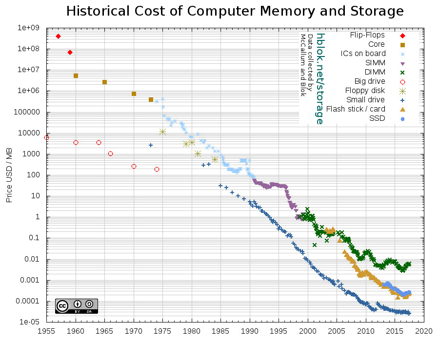
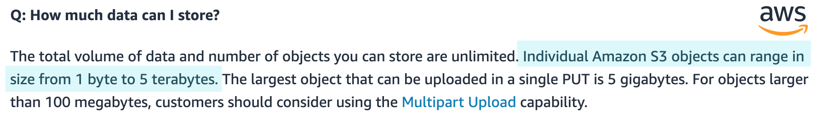

```{r setup, message=FALSE, warning=FALSE, include=FALSE}
pacman::p_load(dplyr, ggplot2)

# TO DO:
# [X] Finish an outline of the presentation: just titles ; almost no text (1h)
# [ ] Add header with name, date, ....
# [ ] Add images, gifs and videos (2h)
# [ ] Clean up the beginning to match the minimalistic presentation style (30 min)
# [ ] Use extra time (bedtime = midnight) to pimp the presentation (colors, shadows, transitions)
# [?] Add something about cloud computing?
# [ ] find a way to store resources in common for all courses
# [ ] add resources (books, sites, etc.)
# [ ] better overall style
# [ ] better graphic style
# [ ] add colors
# [ ] add interactivity for text input (add it live to the presentation)
```

# Large-scale machine-learning

ENSAI 2019-2020 
Arthur Katossky & Rémi Pépin 
CC-BY-SA 

???

This course is in English. You are welcome to ask vocabulary questions at any time.
Try to ask questions in English, but if you tried and can't, you've done your best and you can switch to English.

---

## Motivation

--

Machine-learning algorithms do not scale well.

--
- exact solutions do not scale // ex: matrix inversion is of $O(n^3)$ complexity

--
- approximate solutions do not scale either

???

Some very popular machine-learning algorithms do not scale well.

Exact solutions do not scale: matrix inversion (for instance) is a problem with an algorithmic complexity of $O(n^3)$ ([source](https://en.wikipedia.org/wiki/Computational_complexity_of_mathematical_operations)).

---

background-image: url(img/servers.jpg)

.contrast[ Google's pre-computation of BERT (a neural network for natural language processing) thanks to gradient-descent — a typically non-exact solution — took 4 days on a 64-TPU cluster. ]

.footnote[.contrast[**Source:** [Arxiv](https://arxiv.org/abs/1810.04805) — **Image:** [Wikimedia](https://commons.wikimedia.org/wiki/File:Wikimedia_Foundation_Servers-8055_23.jpg)]]

???

Approximate solutions do not scale either: Lately, Google's pre-computation of BERT (a neural network for natural language processing) thanks to gradient-descent took 4 days on a mesmerizing 64-TPU cluster.

---

## Motivation

Machine-learning algorithms do not scale well.

- exact solutions do not scale // ex: matrix inversion is of $O(n^3)$ complexity
- approximate solutions do not scale either

--

One would thus consider how these computation procedures may be accellerated.

--
- Using algorithmic tricks?

--
- Using more memory?

--
- Parallelizing on several computers?

--
- Relaxing our precision requirements? ...


--

These are many many solutions... and each of this problems is far from tivial!


--

Computing a median can prove challenging to speed up!

---

## Goal

At the end of this course, you will:

--
- understand the potential bottlenecks of data-intensive processes

--
- choose between concurrent solutions for dealing with such bottlenecks

--
- understand the map-reduce principle and have practical experience with Spark on HDFS

--
- have an overview of the cloud computing ecosystem and practical experience with one provider (AWS)

--
- get a glimpse over the *physical*, *ethical*, *economical*, *financial*, *environmental*, *statistical*, *political*... challenges, limitations and dangers of the suggested solutions

???

In this course, we will review the bases of computer science that may be required for accelerating statistical estimation processes.

Ex techniques: sampled vs. exhaustive, sequential vs. parallel, in memory vs. on disk, whole data vs. in chunks, local vs. cloud...

---

## Outline & schedule

--

**Courses:**

- **Course 0:** Introduction to cloud computing (1h30, January 20)
- **Course 1:** Data-intensive computing in a nutshell (3h, January 13)
- **Course 2:** Computing parallelization principles (3h, January 17)
- **Course 3:** Parallelized computing on distributed data (2 × 1h30, January 28, February 6)

--

**Tutorials:**

- **Tutorial 0:** Hands on AWS (1h30)
- **Tutorial 1:** How to optimize a statistical algorithm? (3h, January, 20)
- **Tutorial 2:** How to compute a statistical summary over distributed data? (3h, February, 6)
- **Tutorial 3:** How to accelerate a neural network? (3h, February, 7)

???

There will be 9h course + 1h30 presentation of cloud computing solutions:

There will be 9h tutorials + 1h30 hands-on session with AWS:

The course's content this year is the same as 2nd-year students' "Introduction to Big Data". 1 out of the 3 tutorials (How to accelerate a neural network?) is specific to this course.

<!-- TP2: How to speed up the computation of a statistical summary? -->

---

## Evaluation

- Multiple-choice questionnaire at the beginning of every tutorial
- 1 short tutorial report (tutorial 2)
- Desk examination (most probably multiple-choice questionnaire)

---

## Material

Course and tutorial material will be available on Moodle.

---

# From "Big Data" to "Large Scale"

<!-- intro sur la quantié de données produites -->

---

## What is "Big Data" ?

--
.pull-right[]

---

## What is "Big Data" ?

The term started to be used in the 1990's and is a ill-defined notion.

**Big Data** broadly refers to data that **cannot be managed by commonly-used software**.

???

(It is inherenly relative to **who** and is using it. What is a common software for someone may not be for someone else. Think relational databases for someone used to use spreadsheet software.)

---

## What is "Big Data" ?

.pull-left[

_Line and row limits of Microsoft's Excel tablesheet_

```
           Version      Lines  Columns
until 1995     7.0     16 384      256
until 2003    11.0     65 536      256
from  2007    12.0  1 048 576   16 384
```
]

.pull-right[

_Max. number of items stored in one tablesheet_

```{r, echo=FALSE, fig.height=2.5, fig.width=3.5, out.width="100%"}
breaks <- 10^(1:10)
tibble(
  measurement = "Excel (number of cells)",
  year        = c(1999,2003,2007),
  lines       = c(16384,65536,1048576),
  columns     = c(256,256,16384)
) %>%
  ggplot() +
  geom_line(aes(x=year,y=lines*columns, group="measurement")) +
  scale_y_log10(name=NULL, breaks=breaks,labels =scales:::label_number()) +
  scale_x_continuous(name=NULL, breaks=1999:2010, minor_breaks = NULL) +
  expand_limits(y=1000000) +
  theme(axis.text.x = element_text(angle = -45, hjust = 0))
```

]

???

Target constantly moving as the performance of machines and software continues to increase.

For instance Excel, Microsoft's widely used tablesheet programme, can only cope with a limited number of lines and columns.

---

## What is "Big Data" ?

Size is **not** the only thing that matters.

--

.pull-left[In a tablesheet program, what kind of information can't you store properly?]
.pull-right[]

--
- relationnal data

--
- images, long texts

--
- unstructured data (ex: web page)

--
- rapidly varying data (ex: tweeter feed)

???

Neither is it only a question of size. Since we talk about Excel, it is clear that many different kind of data cannot be stored (or can difficultly be stored) in Excel, for instance:

In a tablesheet program, what kind of information can't you store properly? (ask audience)

---

## What is "Big Data" ?

You will often find the reference to the "3 V's of Big Data"

- **V**olume
- **V**elocity
- **V**ariety¹

.footnote[¹: not really treated in this course]

???

- **V**olume (massive, taking place)
- **V**elocity (fast, updated constantly)
- **V**ariety (tabular, structured, unstructured, of unknown nature, mixed)

Each of these aspects generates specific challenges, and we are often confronted to two or three of them simultaneously! In this large-scale machine-learning course, we will tackle the *volume* and *velocity* aspect.

Marketers and management gurus like to add V's to the V's. You will have **Value**, **Veracity**... and more. You will here about the "5 V's".

---

## How big is "Big Data" ?

<!-- Find some graphics and figures about the size of files.-->

???

Let have a specific attention to volume. Data volume is measured in bits (FR: bit) the basal 1/0 unit in digital storage. One bit can store only 2 states / values. There are multiples of bits, the first one being the byte (FR: octet), equal to 8 bits and able to store as many as $2^8=256$ states / values.

---

## Large-scale computing

<!-- Find some graphics and figures about the computation power of machines.-->

???

Note that what characterises the *data* does not necesserily say anything about the computation you perfom **on** the data. Machine-learning tasks (in the learning phase as well as the prediction phase) can be challenging even with modest amount of data, since some algorithms (typically involving matrix inversion) do not scale well at all. **Scaling** computation will be in the focus of this course. (Of course all this is linked: if we want to update a predicion model on a rapidly arriving massive dataset, we need clever fast computation! Think Spotify's weekly recommandations for their millions of users.)

---

## The limits to storage and computing

???

There are many limits to our ability to store and compute.

A last (but important) dimension is cost. Data can be said to become "big" whenever storing data or computing statistics become so resource-intensive that their price become non negligeable. Imagine when you consider to buy an extra computer only for to perform a given opertion.

Ethical, ecological, political (autonomy) considerations are also at stake and we will spend some time discussing them.

Before we dig into the details and discuss exemples of large-scale machine-learning challenges, a detour to how a typical desktop computer works is needed.

---

# Computer science survival kit

--

A computer can be abstracted by four key components:

--
- processing (FR: processeurs)

--
- memory (FR: mémoire vive)

--
- storage (FR: stockage)

--
- wiring / network (FR: connexions / réseau)

???

Ask audience

---

background-image: url(img/cpu.jpg)
background-size: cover

.pull-right[
## Processors
]

???

The processor is the unit responsible for performing the actual computing.

A processor can be called a "core", a "chip"... and can be differentiated into CPU (central processing units), GPU (graphical processing units) and recently TPU (tensor processing units).[^1]

[1]: Formally, the chip is the physical device, and a chip may enclose one or more logical processors, called cores, in its electronic circuits. Multiple CPU cores on the same die share circuit elements, use less energy, exchange information faster (individual signals can be shorter, degrade slower and do not need to be repeated as often).

A processor performence is measured in how many operations it can perform per second, typically measured in FLOP (floating-point operations per second).

---

## Processors

**What is important for us to know?**

--
- computation happens _physically_

--
- programs must be converted to machine-code

--
- instructions are stored sequentially in a stack / thread

--
- multiple processors may share a stack, or have each their own

--
- processors can be specialized

???

- the elementary computation (addition, multiplication...) happens through a **physical** process
- in order to perform higher-level operations (the source code), instructions must be converted to more basal units of computation (the machine code)
- the low-level instructions are stored sequentially in a stack or thread
- processors draw from the stack ; multiple processors may all draw from the same stack (multi-tread architecture), or on the contrary have each their own (single-thread)
- processors can be hard-wired to specialize into doing some types of computation, this is the case of GPUs and TPUs

---


.footnote[**Source:** Kurzweil ([link](http://www.kurzweilai.net/exponential-growth-of-computing)) via Our World in Data ([link](https://ourworldindata.org/technological-progress))]

???

Processors have made incredible progress over time. And this keeps happening.

---

.height600[]

---

.height600[]

???

"Law" by 1965 by the Intel co-founder Gordon E. Moore.

---

## Processors

**Processing is a limitting factor.**

???

It is costly (it uses energy). One unit can only perform so much operations per second. There is no easy way to combine multiple processors to perform a complex operation.

---

background-image: url(img/ram.jpg)
background-size: cover

## Memory

???

Memory is the unit where the computer temporarily stores the instructions and the data on which to perform computation.

It is also broadly called "cache" or "RAM"[^2].

Memory efficiency is measured by how much information it can contain and how fast in can be read from or written to.

---

## Memory

**What is important for us to know ?**

--
- moving data around takes time

--
- memory is fast (ns)

--
- memory is volatile

--
- memory-processor units are **heavily** optimized

???

What is important to know for us:
- memory is fast, with access time typically measured in nanoseconds
- memory is volatile, meaning that it is lost in case of power interruption
- the easiest way to perform a computation is to move all data in memory — where it becomes accessible to the CPU

---

## Memory

**Memory is a limitting factor.**

???

We can readily perform computation only on a chunk of data that can fit into memory. RAM is very costly: it is still expensive to buy RAM but it is also expensive at use time since it needs electricity to persist data.

<!-- graph of the veolution of memory size -->

[2]: Formally, there is intermediate memory between RAM and the processor: the CPU register is closest to the processor, then comes the CPU cache, on which the computer moves data and instructions that need to for efficiency reasons. "Caching" in general refers to the act of copying a piece of information closer to the place it will be used, such as when storing a local copy of website while navigating over the Internet. RAM (random access memory) is the most-used type of memory.

---

background-image: url(img/storage.jpg)
background-size: contain

## Storage

???

Storage is the unit for long-term storage of information.

It is also called "(disk) space" or "(hard) disk".

Contrary to memory, the disk's non-volatile nature make it suitable to conserving information over long periods. Its first measure of efficiency is thus its size, how long it can retain information without error and how fast you can read from and write on it.

There are other meda of storage, such as... paper, but also digital tapes.

In reality the distinction memory vs. storage is more of a continuum. For instance, SSD disks are faster to read but more expensive to produce.

---

## Storage

**What is important for us to know ?**

--
- storage is faillible

--
- writing and reading is slow (ms)

--
- data is always cached for computation

???

What is important to know for us:
- storage is faillible: errors do occur and information slowly degrades (phenomenon known as data decay: https://en.wikipedia.org/wiki/Data_degradation ; solid state memory like flash card may be corrupted by current ; magnetic field can corrupt disks, tapes ; scratches and dust can corrupt DVDs ; rotting / overuse can corrupt books etc. ; keeping copies often mitigates the problem, but at the cost of maintaining coherence!)
- storage is slow, typically measured in milliseconds [^3]
- computation cannot be performed directly from disk, it has to be temporarily copied into memory (or "cached")

[3]: writing and reading on a disk requires the disk to turn and the reading head to move ; on the top of that, files are split into chunks that are stored at different places and the computer needs a registry to record where what is where

---

## Storage


---

## Storage

**Storage is a limitting factor.**

???

On a given computer, we can only store so much. Today's price of disk space does make it less limitting economically. But if data exceeds the size of the disk, data must be split between several disks, which compicates programming (**distributed storage**).

<!-- average storage capacity ; graph of information degradation over time -->

---

.heigth600[]

---

.heigth600[]

???

2 more things before we move on: network and compilation / intepretation

---

## Network

???

Shorter == better.
<!-- Amazon truck for servers. -->
<!-- Speed vs. cost of services. -->

---

## Interpreting vs. compiling

???

When running a programme written in R or Python, the **source code** is translated into **machine code**.

There are schematically 2 ways to do that:

When **interpreting** the source code, instructions from source code are converted **one by one** into machine code. Say you have an error in your code at line 10. Your programme would execute the first 9 lines then halt with an error.

When **compiling** the source code, instruction from source code are converted **as a whole** into machine code, while performing many optimisation procedures under the hood (ex: multiplying by 2 is just adding an extra 0 to the right in binary ; also you may want to take advantage of the processor pipeline, i.e. the fact that reading the next task from memory can be made to happen *in the same time* than execution of the preceding task). This means that your code with an error would just fail compiling and that "the beginning" (which does not even make sense anymore) will never be executed. Compilation takes time, but it may be worth it if the same programme is run regularly.

Real-world computing is not black and white. For instance most interpreters do perform optimisations on the fly, even though not as thorough as compilers. A common intermediate pattern is **compilation to bytecode**, a platform agnostic language that gets interpreted at run time, or even further compiled to machine code.

---

# Challenges with large-scale machine-learning

???

Intro:
Snowball mobile.
Photo du trou noir.

Some things are more trivial than others.

---

## What if ... ?

---

## What if data is too big to fit in RAM ?

.pull-right[]

--
.pull-left[
1. do less (filter, sample)
2. buy more/bigger memory
3. do things in chunks (stream, pipeline)
4. distribute the data
]

---

## What if ... ?

---

## What if file is too big for file system ?

.pull-right[]

--
.pull-left[
1. do less (filter, sample)
2. change file system
3. cut file into pieces and process in chunk
4. go on databases, that's what they are made for
5. go on cloud, they take care of the problems for you
]

???

Sometimes you don't have the choice. You get data you have to read before you can filter.

---

## What if file is too big for file system ?



---

## What if file is too big for file system ?


---

## What if file is too big for file system ?


---

## What if ... ?

---

## What if data is too big to fit on disk ?

.pull-right[]

--
.pull-left[
1. store less (sample, filter)
2. buy bigger physical disk
3. buy a storage server
4. rent storage space in the cloud
5. distribute data yourself on serval nodes
]

---

## What if ... ?

---

## What if computation takes ages ?


.pull-right[]

--
.pull-left[
1. do less (filter, sample), especially in development stages
2. do less (less tests, less formatting)
3. go low-level (compiling ... or building chips!)
4. profile your code (how does it scale ? where are the bottlenecks?)
5. buy bigger or more cores
6. rent cores on the cloud
7. avoid i/o or network operations
8. **parallelize on non-local nodes**

]

.footnote[
*

**
]

???

We have to distinguish between estimation of a statistical model (always the same call, happen seldom, often only once or twice), developement/research (many requests, often very different from each other) and model in production, for instance for prediction (usually lighter computations, but happen possibly very often). It is rare to be in the case where you both want a very intense computation and you wan to perform it often, exceptions being for instance 3D rendering.

Most used statistical procedures (computing a sum, a mean, a median, inversing a matrix...) are already heavily optimised in traditionnal software, so that you will never need to deep to far in algorithmic machinery.

2. Ex: In R, `parse_date_time()` parses an input vector into POSIXct date-time object ; `parse_date_time2()` is a fast C parser of numeric orders. // Caveat. inputs have to be realiably standardized

3. compile and  

7. minimize communication (maybe you can perform part of the computation in the database, like agregation, and only then communicate the result) ; beware of the cost of data transfer!!!!! Especially when using the cloud! // Unless you can perform reading / writings in parallel to earlier / later tasks, aka. pipelining or streaming.

---

## What if ... ?

---

## What if computation / storage is too expensive ?

.pull-right[]

--

.pull-left[
1. store or compute less (filter, sample)
2. consider cloud computing
3. be carefull with databases requests
4. go from RAM to disk
5. use smaller but moany computing units (ex: scientific grids)
]

???

4. stream, caveat: more communication between disk and memory

---

## What if ... ?

---

## What if data i/o is too fast ?

.pull-right[]

--

.pull-left[
1. for computing: stream / pipeline
2. for storage: fast databases
]

???

There are many distinct problems. For instance, you may have data that **arrive** continuously (think financial operations). On the contrary, many users may want to access the same data often (think newspapers / websites). You may want to do both (think Twitter).

And you may want (or not) to guarantee that your solution can scale, i.e. that it does not depend .

Different solutions can cope with this:
-> streamer (on the computing side) => same problem as distribution: the computation has to be made by chunks
-> database solutisions for fast wirte / fast read ; there's alwasy a trade-off between size, durability, fiability (do I correctly get the last bit of information?), huge subject of research and development ; it is more a question of production (you won't necessarily be concerned with this aspect)

---

# Other issues with Large-Scale Machine-Learning


---

## Statistical issues

???

- statistical power
- false discovery rate & multiple tests
- low information density
- data improper for causal relationships

Big data uses mathematical analysis, optimization, inductive statistics and concepts from nonlinear system identification[24] to infer laws (regressions, nonlinear relationships, and causal effects) from large sets of data with low information density[25] to reveal relationships and dependencies, or to perform predictions of outcomes and behaviors

## Ethical issues

???

- too much information -> everyone is identifiable
- retroactive content (the collection of data depends on what the algorithm produces and the algorithm learns from the data, ex: video recommandations on YouTube)
- security issues (all the 3 giants are forced to comply by the American intelligence agencies)

---

## Environmental issues

???

- environmental resource consumption of storing / computing / communication
- both the energ consumption
- but also what to do with all the waste

---

## Political issues

???

- what independance do you get when all the data is in the hand of a handful of American companies? see the struggle of OVH for existing on this market

---

# Today's conclusion

--
1. MOST DATA IS SMALL BUT COMPUTATION ON IT CAN STILL BE A CHALLENGE

--
2. DISTIBUTING DOES NOT HELP ; DO IT ONLY IF YOU CAN'T AVOID IT

--
3. SAMPLING IS OFTEN A VERY GOOD SOLUTION

--
4. THERE ARE MANY MANY WAYS TO SPEED UP A COMPUTATION

--
5. THERE ARE ENVIRONMENTAL, ECONOMICAL, ETHICAL AND STATISTICAL CHALLENGES WITH THE ACCUMULATION OF SUCH A QUANT